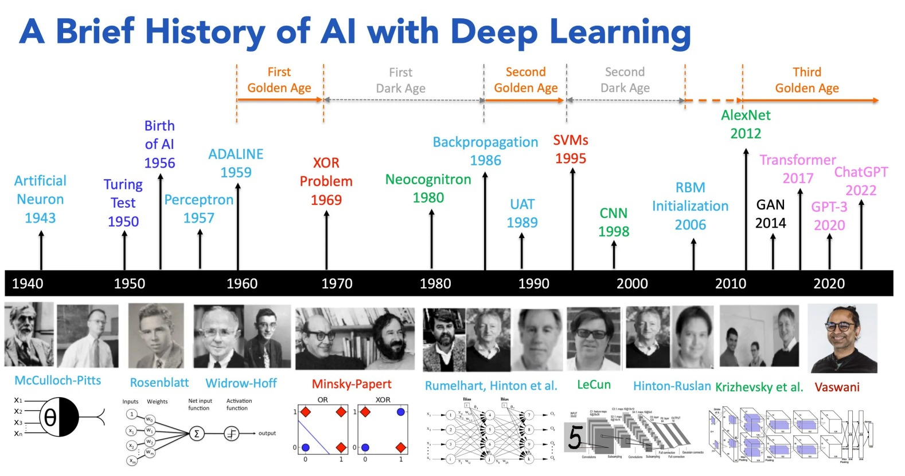
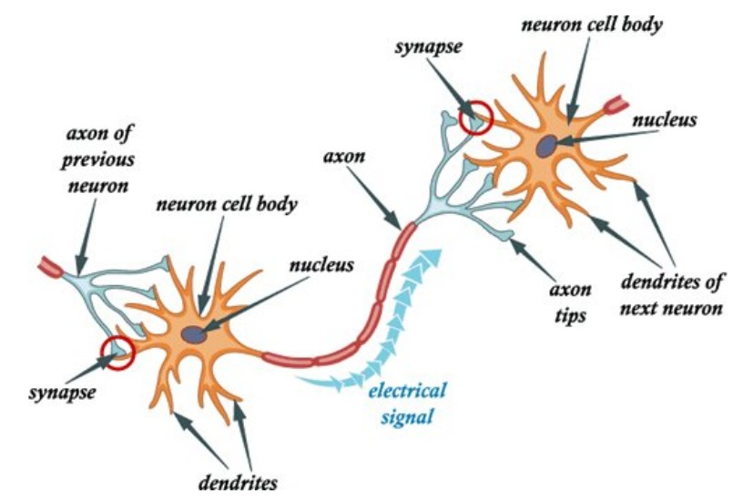
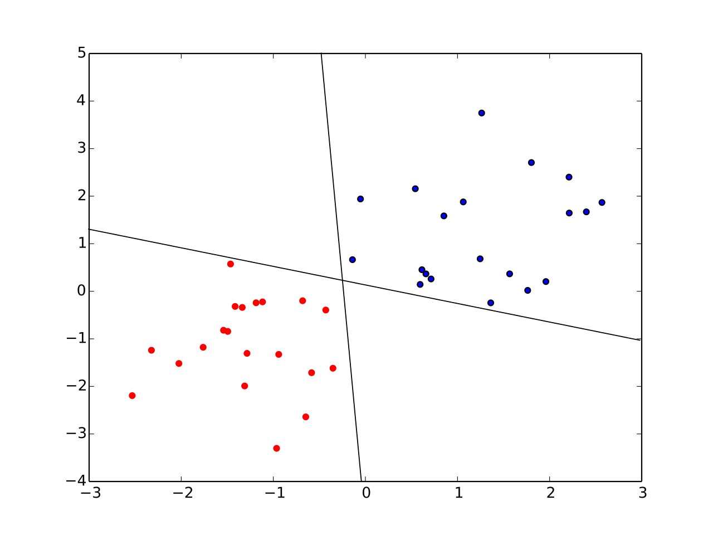
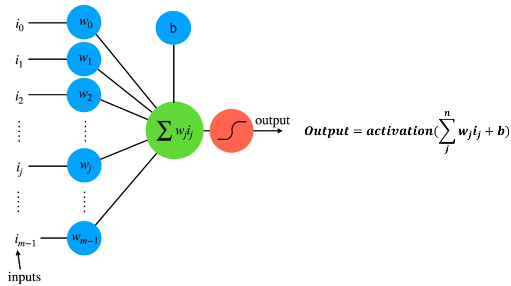
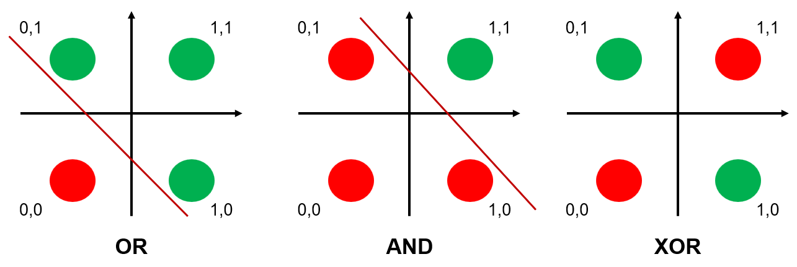

index---
title: "Curso Redes Neurais - Xmeeting 2026"
subtitle: "Introdução a Redes Neurais"
format: 
  clean-revealjs:
    fontsize: 0.6em
    transition: slide
    background-transition: fade
    highlight-style: github
    code-line-numbers: true
    slide-number: true
    chalkboard: true
    controls: true
    footer: "Curso Redes Neurais - Introdução | Lucas Otávio"
    margin: 0.05
    min-scale: 0.2
    max-scale: 2.0
    menu: true
html-math-method:
  method: mathjax
  url: "https://cdn.jsdelivr.net/npm/mathjax@3/es5/tex-mml-chtml.js"
author:
  - name: Lucas Otávio Leme Silva
    email: lucasotavio750@gmail.com
    affiliations: Universidade Tecnológica Federal do Paraná, Cornélio Procópio (UTFPR-CP)
date: last-modified
toc: true
toc-title: "Table of Contents"
toc-depth: 1
---

# Introdução

## Introdução ao Curso

Panorama das atividades:

- **Dia 1:** Fundamentos teóricos de redes neurais: histórico, perceptron e arquitetura de modelos.
- **Dia 2:** Aplicação em dados de RNA para classificação de Covid. Pipeline em PyTorch (estrutura, pré-processamento, treinamento e ajuste de hiperparâmetros).
- **Dia 3:** Modelos convolucionais (CNN) e aplicação em sequências biológicas (DNA/RNA).
- **Dia 4:** Modelos avançados: Transformers e Vision Transformers (ViT).
- **Dia 5:** Introdução a Graph Neural Networks (GNNs).

Implementação em Python com PyTorch.

## Algebra Linear - Revisitando Multiplicação Matriz

<video width="1280" controls>
  <source src="images/MatrixMultiplicationDetailed.mp4" type="video/mp4">
</video>

## História das Redes Neurais

A ideia de rede neural não é algo novo, foi apresentada em 1943 no trabalho de McCulloch e Pitts (modelo computacional de um neurônio). Mas **por que somente recentemente elas ganharam força?** Além disso, **o que é uma rede neural?**
    
Diversas definições já foram propostas:

- Operacionalmente podemos defini-la como: "Sistema complexo que compreende nós e links representados por neurônios e suas conexões" (WARREN et al., 2013)
- Em uma visão mais geral pode ser definida como: "Sistema de processamento de informações composto por um grande número de elementos simples que são interligados diretamente e que cooperam para realizar processamento distribuído paralelo a fim de resolver uma tarefa computacional desejada" (MACUKOW, 2016).

## História das Redes Neurais

<figure class="fragment" data-fragment-index="1" 
        style="position:absolute; top:0; left:0; width:100%; margin:0;">
    
  </a>
  <figcaption style="font-size:1em; margin-top:0.5em;">
    Timeline dos principais acontecimentos no desenvolvimento das Redes Neurais 
  </figcaption>
</figure>

## Quais problemas podem ser resolvidos com redes neurais ?

Quase qualquer problema hoje pode ser resolvido utilizando redes neurais, isso não significa que seja prático ou mesmo a melhor solução. Mas em geral temos problemas envolvendo:

- Classificação
- Regressão
- Detecção de Padrões
- Redução de Dimensionalidade
- Segmentação de Imagens
- Geração de Dados sintéticos

# Formalizando o Problema

## Aprendizado supervisionado

No aprendizado supervisionado nos temos os dados definido por:

$$
    \mathcal{D} = \{(x_i,y_i)\}^{N}_{i=1}
$$

O objetivo é aprender uma função $f(x;\theta) \approx y$ na qual $\theta são os parâmetros do modelo

## Problema de Otimização

Nesse caso quando treinamos o modelo, estamos resolvendo um problema de otimização. A ideia é minimizar o risco que é dado por:

$$
    R(\theta) = \mathbb{E}_{(x,y)\sim P}[\mathcal{L}(y, f(x;\theta))]
$$

Contudo não temos acesso a verdadeira distribuição, por causa disso o que realmente fazemos é minimizar o risco empírico (ou seja com os nossos dados)

$$
    \hat{R}(\theta) = \frac{1}{N}\sum_{i=1}^n \mathcal{L}(y_i, f(x_i;\theta))
$$

- $\mathcal{L} = \text{função de perda}$, ela é definada para verificar a distância entre $y_i$ e $f(x;\theta)$.

## Como resolver esse problema de otimização ?

A partir do problema existem diversas abordagens para tentar encontrar a solução. Diversos deles vocês já devem ter vistos como:

- Regressão Linear
- Regressão Logística
- Support Vector Machines
- Redes Neurais

# Perceptron

## Perceptron - Neurônio

Perceptron foi originalmente proposto como uma abstração matemática de um neurônio biológico.

<figure class="fragment" data-fragment-index="1" 
        style="position:absolute; top:0; left:0; width:100%; margin:0;">
    
  </a>
  <figcaption style="font-size:1em; margin-top:0.5em;">
    Arquitetura Perceptron 
  </figcaption>
</figure>

## Perceptron - Clássico

Perceptron foi criado como um classificador binário para resolver o problema do aprendizado supervisionado. Dado um vetor de vetor de entrada $x$, o modelo define uma função discriminante linear: 

$$ 
    g(x) = w^Tx + b
$$

Em que $w$ é o vetor de pesos e $b$ bias. A regra de decisão induz um classificador binário:

$$ 
    \hat{y} = sign(w^Tx + b), \qquad \hat{y} \in \{-1, +1\}
$$

## Interpretação Geométrica

O conjunto de pontos que satisfaz:

$$
    w^Tx + b = 0
$$

define um hiperplano de decisão em $\mathbb{R}^d$, particiona o espaço em dois semi-espaços:

- $g(x) > 0$ então o ponto está de um lado do hiperplano e podemos definilo como a classe (+1)
- $g(x) < 0$ está no outro lado e portanto classifcado como outra classe (-1).

Nesse caso o vetor peso $w$ é normal ao hiperplano e controla a sua orientação, enquanto $b$ desloca a sua posição. 

## Exemplo

Em um problema em que temos duas classes linearmaente separaveis com apenas 2 features, ou seja $x \in \mathbb{R}^2$, o hiperplano se reduz a uma reta $w_1x_1 + w_2x_2 + b = 0$.

<figure class="fragment" data-fragment-index="1" 
        style="position:absolute; top:0; left:0; width:80%; margin:0;">
    
  </a>
  <figcaption style="font-size:1em; margin-top:0.5em;">
    Problema classficação Linear
  </figcaption>
</figure>

## Formulação como Problema de Otimização

O Perceptron pode ser visto como um algoritmo que busca (w,b) tal que:

$$
    y_i(w^Tx_i + b) > 0, \forall i
$$

Quando isso não ocrre atualiza de forma iterativa para encontrar o melhor peso:

$$
    w \leftarrow w + \nu y_i x_i \\
    b \leftarrow b + \nu y_i
$$

## Visão Moderna

O Perceptron pode ser interpretado como uma unidade computacional composta por:

- 1° Combinação Linear: $z = w^Tx + b$
- 2° Função de ativação: $\hat{y} = \phi(z)$

No perceptron clássico o $\phi(z) = sign(z)$, que foi substituido por funções de ativação mais modernas como ReLU, sigmoid, tanh, entre outros que veremos mais para frente. 

## 

<figure class="fragment" data-fragment-index="1" 
        style="position:absolute; top:0; left:0; width:100%; margin:0;">
    
  </a>
  <figcaption style="font-size:1em; margin-top:0.5em;">
    Arquitetura Perceptron 
  </figcaption>
</figure>

## Perceptron - Limitações

Um único perceptron tem capacidade de resolver apenas problemas linearmente separáveis. Minsky & Papert provaram (Perceptrons, 1969) que existem restrições sobre o que as redes Perceptron são capazes de representar utilizando o problema clássico XOR:

<figure class="fragment" data-fragment-index="1" 
        style="position:absolute; top:80; left:0; width:100%; margin:0;">
    
  </a>
  <figcaption style="font-size:1em; margin-top:0.5em;">
    Problema XOR
  </figcaption>
</figure>

## Perceptron - Solução

Com a evolução das pesquisas em redes neurais e, principalmente, o avanço da tecnologia, essas limitações foram superadas através dos seguintes fatores:

- Introdução das Redes Neurais Multicamadas (MLP - Multilayer Perceptron) que utilizam múltiplos neurônios organizados em várias camadas.
- Introdução de funções de ativação mais complexas.
- Novo algoritmo (backpropagation) para atualizar os parâmetros, permitindo atualização eficiente dos pesos, e possibilitando o treinamento de redes mais profundas.

# Estrutura de um modelo

## Estrutura geral de um modelo

Nos próximos slides vamos entender como funciona a estrutura de um modelo de rede neural. Ela é composta pelas seguintes partes:

- Camadas do Modelo
- Funções de Ativação
- Função de Perda
- Otimizador