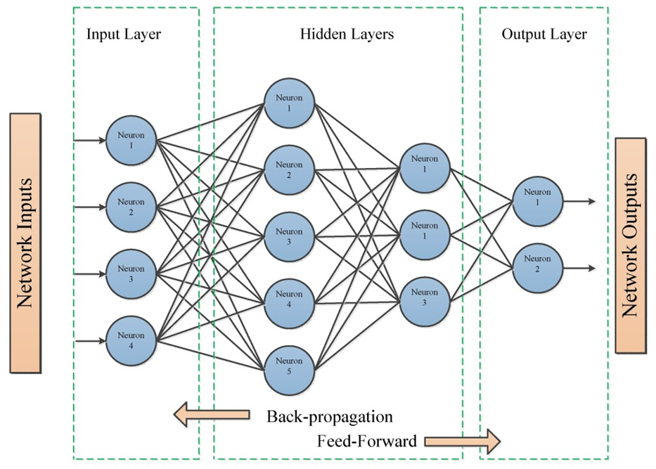
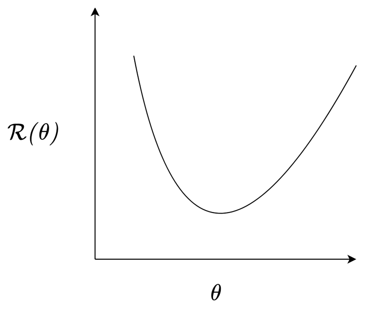
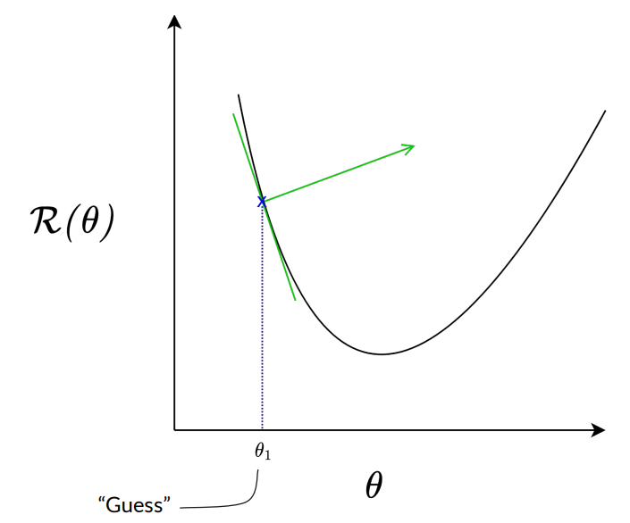
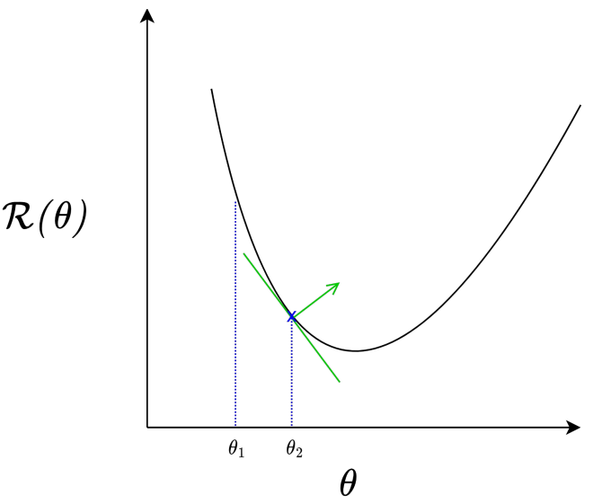
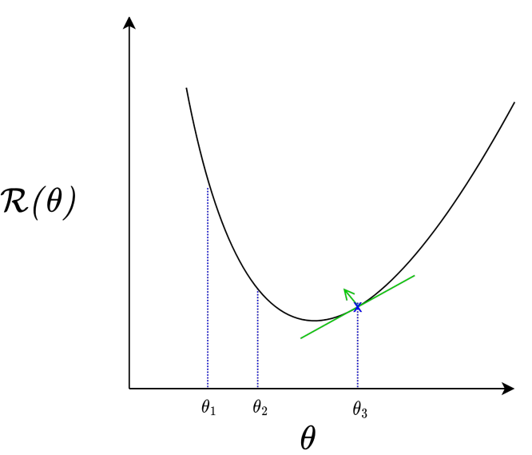
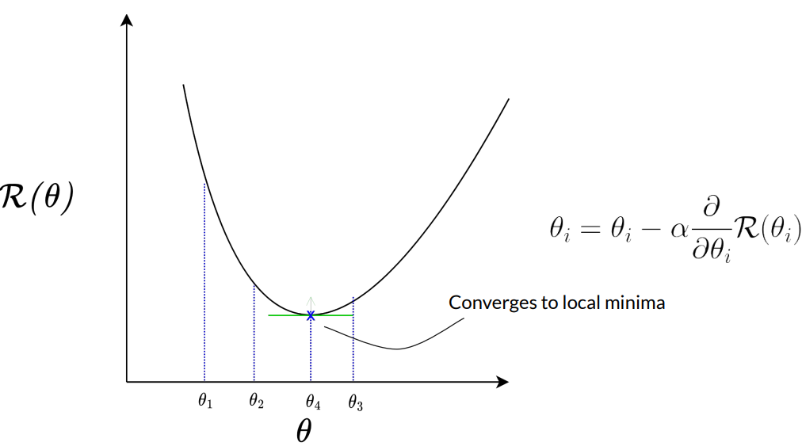
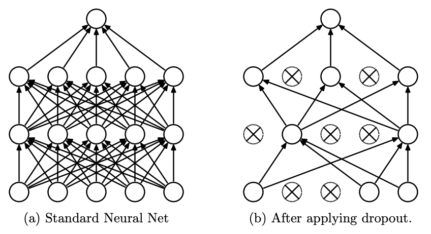
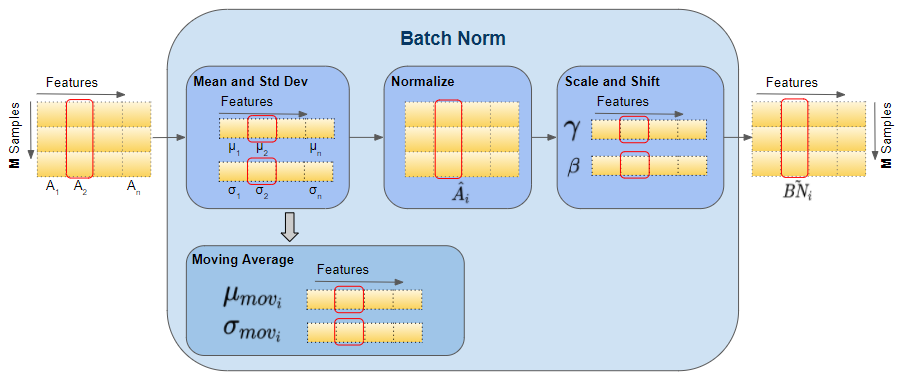
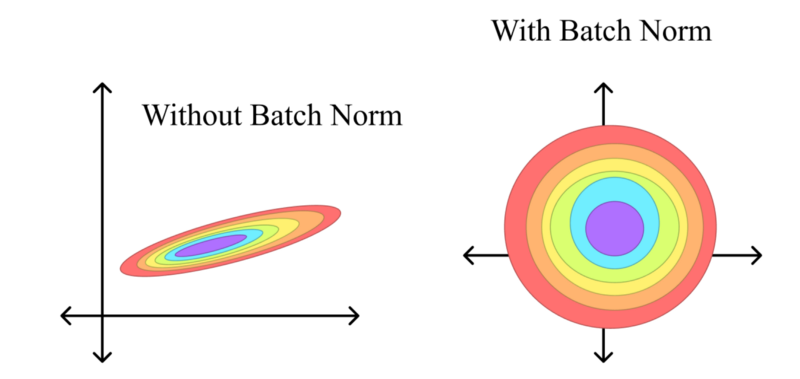
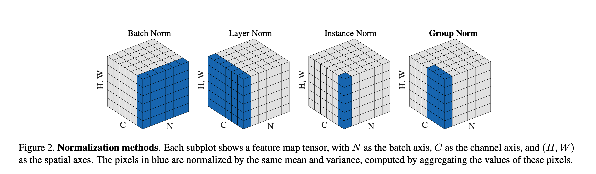

# Introdução

## Introdução ao Curso

Panorama das atividades:

- **Dia 1:** Fundamentos teóricos de redes neurais: histórico, perceptron e arquitetura de modelos.
- **Dia 2:** Aplicação em dados de RNA para classificação de Covid. Pipeline em PyTorch (estrutura, pré-processamento, treinamento e ajuste de hiperparâmetros).
- **Dia 3:** Modelos convolucionais (CNN) e aplicação em sequências biológicas (DNA/RNA).
- **Dia 4:** Modelos avançados: Transformers e Vision Transformers (ViT).
- **Dia 5:** Introdução a Graph Neural Networks (GNNs).

Implementação em Python com PyTorch.

## Álgebra Linear - Revisitando Multiplicação Matriz

<video width="1280" controls>
  <source src="images/MatrixMultiplicationDetailed.mp4" type="video/mp4">
</video>

## História das Redes Neurais

A ideia de rede neural não é algo novo, foi apresentada em 1943 no trabalho de McCulloch e Pitts (modelo computacional de um neurônio). Mas **por que somente recentemente elas ganharam força?** Além disso, **o que é uma rede neural?**  
Diversas definições já foram propostas:

- Operacionalmente podemos defini-la como: "Sistema complexo que compreende nós e links representados por neurônios e suas conexões" (WARREN et al., 2013)
- Em uma visão mais geral pode ser definida como: "Sistema de processamento de informações composto por um grande número de elementos simples que são interligados diretamente e que cooperam para realizar processamento distribuído paralelo a fim de resolver uma tarefa computacional desejada" (MACUKOW, 2016).

## História das Redes Neurais

<figure class="fragment" data-fragment-index="1" 
        style="position:absolute; top:0; left:0; width:100%; margin:0;">
    
  </a>
  <figcaption style="font-size:1em; margin-top:0.5em;">
    Linha do Tempo das Redes Neurais 
  </figcaption>
</figure>

## Quais problemas podem ser resolvidos com redes neurais ?

Quase qualquer problema hoje pode ser resolvido utilizando redes neurais, isso não significa que seja prático ou mesmo a melhor solução. Mas em geral temos problemas envolvendo:

- Classificação
- Regressão
- Detecção de Padrões
- Redução de Dimensionalidade
- Segmentação de Imagens
- Geração de Dados sintéticos

# Formalizando o Problema

## Aprendizado supervisionado

No aprendizado supervisionado nos temos os dados definido por:

$$
    \mathcal{D} = \{(x_i,y_i)\}^{N}_{i=1}
$$

O objetivo é aprender uma função $f(x;\theta) \approx y$ na qual $\theta$ são os parâmetros do modelo

## Problema de Otimização

Nesse caso quando treinamos o modelo, estamos resolvendo um problema de otimização. A ideia é minimizar o risco que é dado por:

$$
    R(\theta) = \mathbb{E}_{(x,y)\sim P}[\mathcal{L}(y, f(x_i;\theta))]
$$

Contudo não temos acesso a verdadeira distribuição, por causa disso o que realmente fazemos é minimizar o risco empírico (ou seja com os nossos dados)

$$
    \hat{R}(\theta) = \frac{1}{N}\sum_{i=1}^n \mathcal{L}(y_i, f(x_i;\theta))
$$

- $\mathcal{L} = \text{função de perda}$, ela é definada para verificar a distância entre $y_i$ e $f(x;\theta)$.

## Como resolver esse problema de otimização ?

A partir do problema existem diversas abordagens para tentar encontrar a solução. Diversos deles vocês já devem ter vistos como:

- Regressão Linear
- Regressão Logística
- Support Vector Machines
- Redes Neurais

# Perceptron

## Perceptron - Neurônio

Perceptron foi originalmente proposto como uma abstração matemática de um neurônio biológico.  

<figure class="fragment" data-fragment-index="1" 
        style="position:absolute; top:0; left:0; width:100%; margin:0;">
    
  </a>
  <figcaption style="font-size:1em; margin-top:0.5em;">
    Neurônio Biológico 
  </figcaption>
</figure>

## Perceptron - Clássico

Perceptron foi criado como um classificador binário para resolver o problema do aprendizado supervisionado. Dado um vetor de vetor de entrada $x$, o modelo define uma função discriminante linear: 

$$ 
    g(x) = w^Tx + b
$$

Em que $w$ é o vetor de pesos e $b$ bias. A regra de decisão induz um classificador binário:

$$ 
    \hat{y} = sign(w^Tx + b), \qquad \hat{y} \in \{-1, +1\}
$$

## Interpretação Geométrica

O conjunto de pontos que satisfaz:

$$
    w^Tx + b = 0
$$

define um hiperplano de decisão em $\mathbb{R}^d$, particiona o espaço em dois semi-espaços:

- $g(x) > 0$ então o ponto está de um lado do hiperplano e podemos definilo como a classe (+1)
- $g(x) < 0$ está no outro lado e portanto classifcado como outra classe (-1).  

Nesse caso o vetor peso $w$ é normal ao hiperplano e controla a sua orientação, enquanto $b$ desloca a sua posição. 

## Exemplo

Em um problema em que temos duas classes linearmaente separaveis com apenas 2 features, ou seja $x \in \mathbb{R}^2$, o hiperplano se reduz a uma reta $w_1x_1 + w_2x_2 + b = 0$.

<figure class="fragment" data-fragment-index="1" 
        style="position:absolute; top:0; left:0; width:80%; margin:0;">
    
  </a>
  <figcaption style="font-size:1em; margin-top:0.5em;">
    Problema classficação Linear
  </figcaption>
</figure>

## Formulação como Problema de Otimização

O Perceptron pode ser visto como um algoritmo que busca $(w,b)$ tal que:

$$
    y_i(w^Tx_i + b) > 0, \forall i
$$

Quando isso não ocrre atualiza de forma iterativa para encontrar o melhor peso:

$$
    w \leftarrow w + \eta y_i x_i
$$

$$
    b \leftarrow b + \eta y_i
$$

## Visão Moderna

O Perceptron pode ser interpretado como uma unidade computacional composta por:

- 1° Combinação Linear: $z = w^Tx + b$
- 2° Função de ativação: $\hat{y} = \phi(z)$

No perceptron clássico o $\phi(z) = sign(z)$, que foi substituido por funções de ativação mais modernas como ReLU, sigmoid, tanh, entre outros que veremos mais para frente. 

## 

<figure class="fragment" data-fragment-index="1" 
        style="position:absolute; top:0; left:0; width:100%; margin:0;">
    
  </a>
  <figcaption style="font-size:1em; margin-top:0.5em;">
    Arquitetura Perceptron 
  </figcaption>
</figure>

## Perceptron - Implementação

Primeiro antes de implementar um perceptron do zero em Python. Vamos mostrar passo a passo como os pesos são atualizados. Para isso vamos usar o problema "OR", nesse caso temos os dados:

- $\mathcal(D) = \{([0, 1], 1), ([1, 1], 1), ([1, 0], 1), ([0, 0], -1) \}$
- Como vemos temos 2 features, nesse caso temos que encontrar $[w_1, w_2, b]$. 

Para começar vamos começar com valores aleatórios $[0, 0, 0]$ e $\eta = 1$.

##  Processo

- 1° interação: Relembrando $\hat{y_i} = sign(w^Tx_i + b) \rightarrow sign([0, 1]^T*[0, 0] + 0) = 0$. Logo atualiza os parâmetros $w \leftarrow [0, 0] + (1)[0, 1] = [0, 1]$ e $b = 0 + 1 = 1$.
- 2° interação: $sign([1, 1]^T * [0, 1] + 1) = 1$, correto não atualiza parâmetros.
- 3° interação: $sign([1, 0]^T * [0, 1] + 1) = 1$, correto.
- 4° interação: $sign([0, 0]^T * [0, 1] + 1) = 1$, errado, logo $w \leftarrow [0, 1] + (-1)[0, 0] = [0, 1]$ e $b = 1 - 1 = 0$

## Processo

- 5° interação: Vai dar certo até $sign([1, 0]^T * [0, 1] + 0) = 0$, errado logo $w \leftarrow [0, 1] + (1)[1, 0] = [1, 1]$ e $b = 0 + 1 = 0$
- 6° interação: $sign([1, 1]^T * [0, 0] + 1) = 1$, errado logo $w \leftarrow [1, 1] + (-1)[0, 0] = [1, 1]$ e $b = 1 + -1 = 0$
- 7° interação: Via dar certo até voltar para mesmo caso $sign([1, 1]^T * [0, 0] + 0) = 0$, errado logo $w \leftarrow [1, 1] + (-1)[0, 0] = [1, 1]$ e $b = 0 - 1 = -1$. 

Com isso todos os valores estão corretos, logo os parâmetros que ajustam esse problema são $w [1, 1]$ e $b = -1$. 

## Perceptron - Limitações

Um único perceptron tem capacidade de resolver apenas problemas linearmente separáveis. Minsky & Papert provaram (Perceptrons, 1969) que existem restrições sobre o que as redes Perceptron são capazes de representar utilizando o problema clássico XOR:

<figure class="fragment" data-fragment-index="1" 
        style="position:absolute; top:80; left:0; width:100%; margin:0;">
    
  </a>
  <figcaption style="font-size:1em; margin-top:0.5em;">
    Problema XOR
  </figcaption>
</figure>

## Perceptron - Solução

Com a evolução das pesquisas em redes neurais e, principalmente, o avanço da tecnologia, essas limitações foram superadas através dos seguintes fatores:

- Introdução das Redes Neurais Multicamadas (MLP - Multilayer Perceptron) que utilizam múltiplos neurônios organizados em várias camadas.
- Introdução de funções de ativação mais complexas.
- Novo algoritmo (backpropagation) para atualizar os parâmetros, permitindo atualização eficiente dos pesos, e possibilitando o treinamento de redes mais profundas.

# Redes Neurais

## Como podemos entender redes neurais ? 

As redes neurais podem ser vistas como composições de funções que permitem modelar não linearidades complexas.

$$
  f(x) = f_L \circ f_{L-1} \circ \dots \circ f_1(x)
$$

Vimos até agora uma dessas funções que podmeos utilizar:

$$
  f_i(x) = \phi(w^T*x + b)
$$

E como podemos observar podemos repetir essa mesma estrutura várias vezes. Essas estruturas nós podemos chamar de camadas, ou seja, redes neurais são uma composição de múltiplas camadas.

## Pipeline Geral de Treinamento

Nos próximos slides vamos entender como funciona a estrutura de um modelo de rede neural, isso será feito através do entendimento de como é feito o pipeline do treinamento delas, que consiste nas seguintes etapas:

- Forward pass
- Cálculo da loss
- Backpropagation
- Atualizaçaõ dos parâmetros

Esse é o loop que define o aprendizado das redes neurais

## Exemplificação

Esse loop de aprendizado pode ser visto na figura abaixo:

<figure class="fragment" data-fragment-index="1" 
        style="position:absolute; top:80; left:0; width:100%; margin:0;">
    
  </a>
</figure>

## Forward Pass

O foward pass nada mais é do que o cálculo da saída ou seja $\hat{y} = f(x;\theta)$. 

## Função de Perda

A função de perda é uma parte essencial de qualquer modelo de rede neural, ela define uma forma de calcular a diferença entre a previsão do modelo e o valor que se desejaria obter. Podemos escrever isso como:

$$ 
  \mathcal{L}(y, \hat{y})
$$

Dependendo do seu problema você irá utilizar diferentes funções de perda (em alguns casos até que criar um), vamos ver os 3 principais que usamos em quase todos os casos:

- Erro Quadrático Médio / Mean Squared Error (MSE)
- Binary Cross-Entropy e sua versão generalizada Cross-Entropy

Artigo interessante: https://arxiv.org/pdf/2307.02694

## MSE

MSE normalmente é usado em casos de regressão, ou seja, em casos que desejamos prever um valor contínuo.

$$
  \frac{1}{N} \sum (y - \hat{y})^2
$$

## Binary Cross-Entropy

Essa função de perda é utilizada para os casos de classificação binária (relacionado com a entropia de Shannon)

$$
  \mathcal{L} = -[y \log(\hat{y}) + (1-y)\log(1-\hat{y})]
$$

## Cross-Entropy

É a generalização da Binary Cross-Entropy, nesse caso é utilizado quando queremos fazer uma classificação com várias classes (além de apenas 2)

$$
  \mathcal{L} = -\sum_i y_i \log(\hat{y}_i)
$$

## Backpropagation

Relembrando nosso objeto que era minimizar o risco empirico, para realizar isso na rede neural utilizamos o algoritmo backpropagation que calcula algo chamado de "gradiente (\nabla)" da função de custo. 
Basicamente o que ele faz é calcular a derivada parcial da função de perda em relação a cada peso, propagando o erro da última camada até a primeira ("trás para frente") uitlizando a regra da cadeia.

$$
  \mathcal{L}(f(x), y) \rightarrow \frac{\partial \mathcal{L}(f(x), y)}{w_i} 
$$

$$
  \frac{\partial y}{\partial x} = \frac{\partial y}{\partial u} \frac{\partial u}{\partial x}
$$

## Interpretação Geométrica da Derivada

A derivada geometricamente representa a inclinação da reta tangente ao gráfico de uma função. Fermat percebeu que era possível encontrar os máximos e mínimos de uma função a partir de suas derivadas.

<figure class="fragment" data-fragment-index="1" 
        style="position:absolute; top:80; left:0; width:100%; margin:0;">
    
  </a>
</figure>

## Interpretação Geométrica da Derivada

<figure class="fragment" data-fragment-index="1" 
        style="position:absolute; top:80; left:0; width:100%; margin:0;">
    
  </a>
</figure>

## Interpretação Geométrica da Derivada

<figure class="fragment" data-fragment-index="1" 
        style="position:absolute; top:80; left:0; width:100%; margin:0;">
    
  </a>
</figure>

## Interpretação Geométrica da Derivada

<figure class="fragment" data-fragment-index="1" 
        style="position:absolute; top:80; left:0; width:100%; margin:0;">
    
  </a>
</figure>

## Interpretação Geométrica da Derivada

<figure class="fragment" data-fragment-index="1" 
        style="position:absolute; top:80; left:0; width:100%; margin:0;">
    
  </a>
  <figcaption style="font-size:1em; margin-top:0.5em;">
    Descida do Gradiente
  </figcaption>
</figure>

## Atualização dos Pesos

Esse algoritmo que acabamos de ver é um otimizador conhecido como Gradient Descent, com isso os pesos do nosso modelo de rede neural podem ser atualizados simplesmente com:

$$
  \theta_{t+1} = \theta_t - \eta \nabla_\theta \mathcal{L}
$$

Não se preocupe, na prática você não precisa calcular as derivadas, as bibliotecas como pytorch calculam o gradiente de forma automatica. Contudo, entender esse processo é fundamental.

## Exemplo

Vamos fazer esse processo de atualizar os parâmetros em um caso simples (sem regra da cadeia), imagine que queremos encontrar o mínimo da função $f(x, y) = x^2 + y^2$, e temos 2 valores iniciais aleatórios $x=4$ e $y=2$.
O gradiente vai ser dado por $\nabla f(x, y) = (\frac{\partial f}{\partial x}, \frac{\partial f}{\partial y}) = (2x, 2y)

- 1° interação: $x^{(0)} = 4$ e $y^{(0)} = 2$, $\nabla f(4, 2) = (8, 4)$. Com isso, usando $\eta = 0.1$ temos $(4, 2) - 0.1(8,4) = (3.2, 1.6)$

Se verificarmos o valor da função veremos que estamos diminuindo 

$$
  f(4,2) = 16 + 4 = 20 \qquad f(3.2, 1.6) = 10.24 + 2.56 = 12.8
$$

## Exemplo

- 2° interação:  $x^{(1)} = 3.2$ e $y^{(0)} = 1.6$, $\nabla f(3.2, 1.6) = (6.4, 3.2)$. Com isso temos $(3.2, 1.6) - 0.1(6.4,3.2) = (2.56, 1.28)$

Novamente vemos que estamos cada vez mais perto de $(0,0)$ que é o mínimo da função, continuando isso chegaremos ao mínimo da função.

# Estrutura do Modelo

## Estrutura do Modelo

Os principais elementos que definem uma rede neural são:

- Camadas
- Funções de Ativação
- Função de Perda
- Otimizador

Até agora já vimos quais são as funções de perda, uma das camadas mais utilizadas que é a camada de perceptrons e também vimos algumas funções de ativação (sign e tanh). 
Nos próximos slides veremos algumas outras camadas, um apanhado geral das funções de ativação e entender o otimizador moderno ADAM.

## Funções de Ativação

As funções de ativação possuem um papel central nas redes neurais, são elas que introduzem na rede a não linearidade que é o elemento necessário para se aprender padrões complexos. Atualmente existem uma série de funções de ativação
cada uma com suas particularidades, vantagens e desvantagens. Entre elas estão:

- ReLU (Rectified Linear Unit), Leaky ReLU, RReLU, PReLU
- ELU, SELU
- Sigmoid, Tanh, Softmax
- Funções mais modernas: GELU, Swish, Mish, APALU
- Mais recentemente temos as funções de ativação ocilatorias: GCU, DSU, NCU, SQU, SSU
Vamos observar algumas com mais detalhes

## ReLU

  Relu é basicamente a função de ativação mais utiliza em redes neurais, ganhou muita popularidade por sua extrema eficiência.

  $$
    ReLU(x) = max(0, x)
  $$

  - Vantagens: Resolve o problema do Vanishing Gradient Problem e rapida computacionalmente. 
  - Desvantagens: Fornece gradiente apenas na direção positiva, para entra negativa ela "não faz nada", isso acaba gerando um dos maiores problemas da ReLU conhecido como Dying ReLU 

  Artigos interessantes: https://arxiv.org/pdf/1903.06733, https://arxiv.org/abs/2505.22074

## Leaky ReLU
  
  Leaky ReLU foi feito para tentar superar o problema dos neurônios mortos da ReLu, isso é feito adicionado um declibe na função aos valores negativos utilizando uma variável de controle
  
  $$
    Leaky Relu(x) = max(\alpha*x, x)
  $$

  - Desvantagem: Principal desvantagem desse metodo é um parâmetro que tem que ser especificado. Por isso surgimento de variantes como RReLU e PReLU.

## Sigmoid

Antigamente a Sigmoid era a principal função de ativação, utilizada em toda a rede neural, contudo ela apresenta diversos problemas, dentre eles o maior é o Vanishing Gradient Problem que é causado pela saturação dos valores positivos e negativos.

$$
  \sigma(x) = \frac{1}{1 + e^{-x}}
$$

Basicamente a sigmoid não é mais utilizada nas camadas intermediarias das redes, contudo ela ainda tem uma grande utilidade. Para classificação binária ela se torna muito interessante, isso porque como sua saída varia de 0 a 1, temos que ela
transforma o valor de saída da rede em uma probabilidade.

## Softmax

Tem a mesma ideia da Sigmoid, ou seja, de transformar a saída em uma probabilidade, mas nesse caso para classificação multiclasse.

$$
  Softmax(x_i) = \frac{e^{x_i}}{\sum_{j}e^{x_j}}
$$

Exemplo: Queremos classificar uma imagem entre cachorro, gato, coelho. Imagine que a saída do modelo resulta em 1.75 para cachorro, 3.90 para gato e 4.35 para coelho. Utilizando a fórmula acima, a saída do modelo será: 0.04 para cachorro, 0.37 gato e 0.59 para coelho.

## GELU

Funções mais modernas como a GELU tem uma maior capacidade de aprender padrões mais complexos, normalmente em troca de uma complexidade maior. A GELU além de ser uma função suave (tem derivada em todos os pontos) é o estado da arte para modelos baseados em transformers.

$$
  GELU(x) = x * \Phi(x) \approx 0.5*x(1 + Tanh(\sqrt{\frac{2}{\pi}}*(x + 0.044715*x^3)))
$$

## APALU

Adaptive piecewise approximated activation linear unit (APALU), é uma função em que a rede aprende os parâmetros para a função de ativação (paramétrica), totalmente adaptavel e maleavel. Fazendo com que ela funcione bem para dados complexos.

$$
  APALU(x) = \begin{cases} a(x + x(\frac{1}{1 + e^{-1.702(x)}})), & x \geq 0 \\ b(e^x - 1), & x < 0\end{cases}
$$

## GCU

Growing Cosinet Unit (GCU) foi um das primeiras funções de ativação a trazer funções de ativação oscilatórias, a grande novidade foi que com a GCU é possível resolver o problema XOR com um único neurônio. Contudo suas propriedades e utilização prática foram pouco exploradas.

$$
  GCU(x) = x*cos(x)
$$

## Camadas

Um modelo é basicamente feito por várias camadas, cada uma tendo uma função específica no modelo. As que vamos ver/vimos hoje são:

- Dense: Camada mais comum de redes neurais. Composta por vários perceptrons, na qual cada perceptron está totalmente conectado a camada anterior.
- Dropout: Camada que tem como objetivo evitar overfitting. 
- Batch Normalization: Estabiliza o treinamento e melhora a convergência.

## Dropout

O que ele faz é desativar perceptrons aleatoriamente durante o treinamento, isso ajuda a reduzir o overfitting do modelo. *Obs: No teste essa camada é desativada e todos os perceptrons são utilizados

<figure class="fragment" data-fragment-index="1" 
        style="position:absolute; top:80; left:0; width:100%; margin:0;">
    
  </a>
</figure>

## Batch Normalization

Principal função dessa camada é estabilizar o treinamento das redes neurais. O que ele faz é normalizar os dados para ter media 0 e variância 1.

<figure class="fragment" data-fragment-index="1" 
        style="position:absolute; top:80; left:0; width:100%; margin:0;">
    
  </a>
  <figcaption style="font-size:1em; margin-top:0.5em;">
    Batch Normalization
  </figcaption>
</figure>

## Batch Normalization

Quando não há normalização, algumas variáveis podem ter escalas muito diferentes, o que leva a gradientes desbalanceados. Com isso, uma variável pode ter magnitude muito maior no gradiente, enquanto outra tem magnitude muito pequena. Esse desbalanceamento pode prejudicar o desempenho dos algoritmos de otimização. 

<figure class="fragment" data-fragment-index="1" 
        style="position:absolute; top:80; left:0; width:100%; margin:0;">
    
  </a>
</figure>

## Tipos de Normalização

Existem diferentes estratégias de normalização:

- Batch Normalization normaliza as ativações utilizando estatísticas calculadas ao longo do minibatch.
- Layer Normalization realiza a normalização considerando todas as ativações de uma mesma camada para cada amostra.
- Instance Normalization normaliza cada amostra individualmente, sem depender de outras observações no batch. 
- Group Normalization divide os canais em grupos e realiza a normalização dentro de cada grupo.

## Tipos de Normalização

<figure class="fragment" data-fragment-index="1" 
        style="position:absolute; top:80; left:0; width:100%; margin:0;">
    
  </a>
</figure>

## Otimizadores

Mesmo que o SGD tenha bons resultados, na prática hoje em dia utilizamos princiaplemnte otimizadores mais modernos, quase todos variantes do ADAM. Primeiro temos que entender quais são os principais problemas do SGD:

- Taxa de aprendizado fixa
- Demora na convergência em funções com muitos parâmetros

## ADAM 

O ADAM utiliza um princípio da físico chamado de Momentum. Em vez de atualizar os parâmetros de forma lenta e direta, o Momentum "acelera" a otimização, levando em consideração a direção passada dos gradientes, o que ajuda a acelerar a convergência.

No ADAM, existem dois parâmetros principais chamados $\beta_1$ e $\beta_2$ que controlam o cálculo dos momentos.

- $\beta_1$: Controla a média exponencial dos gradientes passados (momento de primeira ordem).
- $\beta_2$: Controla a média exponencial dos quadrados dos gradientes passados (momento de segunda ordem).

## ADAM

As atualizações dos parâmetros seguem a fórmula:

$$
  m_t = \beta_1 \cdot m_{t-1} + (1 - \beta_1) \cdot g_t
$$

$$
  v_t = \beta_2 \cdot v_{t-1} + (1 - \beta_2) \cdot g_t^2
$$

Onde: $m_t$ é o momento de primeira ordem, $v_t$ é o momento de segunda ordem e $g_t$ é o gradiente no tempo $t$. 

## ADAM

Além disso, o ADAM aplica uma correção para compensar as estimativas iniciais de $m_t$ e $v_t$:
    
$$
  \hat{m}_t = \frac{m_t}{1 - \beta_1^t}, \quad \hat{v}_t = \frac{v_t}{1 - \beta_2^t}
$$

Os parâmetros são atualizados da seguinte forma:

$$
  \theta_t = \theta_{t-1} - \frac{\eta}{\sqrt{\hat{v}_t} + \epsilon} \cdot \hat{m}_t
$$

## ADAMW

Uma das variações mais populares do ADAM é o ADAMW. Ele implementa um weight decay, que aplica uma regularização no modelo. A fórmula da atualização dos parâmetros é modificada para:

$$
  \theta_t = \theta_{t-1} - \frac{\eta}{\sqrt{\hat{v}_t} + \epsilon} \cdot \hat{m}_t + \eta \lambda\theta_{t-1}
$$

O parâmetro $\lambda$ controla o fator de decaimento de peso. Ajuda a evitar overfitting e garante maior estabilidade ao modelo.

# Referências 

## Referências

- Goodfellow, Ian, et al. Deep learning. Vol. 1. No. 2. Cambridge: MIT press, 2016.
- Theodoridis, Sergios, and Konstantinos Koutroumbas. Pattern recognition. Elsevier, 2006.
- Dubey, Shiv Ram, Satish Kumar Singh, and Bidyut Baran Chaudhuri. "Activation functions in deep learning: A comprehensive survey and benchmark." Neurocomputing 503 (2022): 92-108.
- Kingma, Diederik P., and Jimmy Ba. "Adam: A method for stochastic optimization." arXiv preprint arXiv:1412.6980 (2014).
- Ruder, Sebastian. "An overview of gradient descent optimization algorithms." arXiv preprint arXiv:1609.04747 (2016).

## Referências

- Wu, Yuxin, and Kaiming He. "Group normalization." Proceedings of the European conference on computer vision (ECCV). 2018.
- Loshchilov, Ilya, and Frank Hutter. "Decoupled weight decay regularization." arXiv preprint arXiv:1711.05101 (2017).
- Rosenblatt, Frank. "The perceptron: a probabilistic model for information storage and organization in the brain." Psychological review 65.6 (1958): 386.

