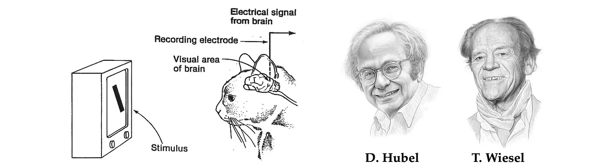
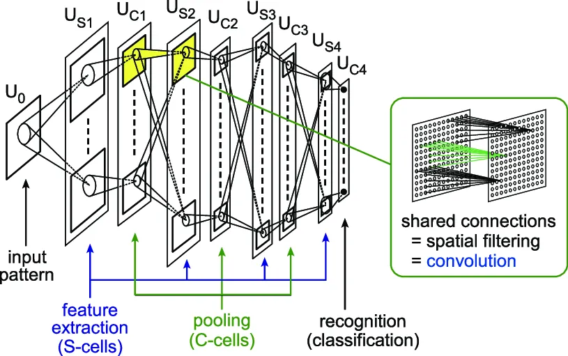
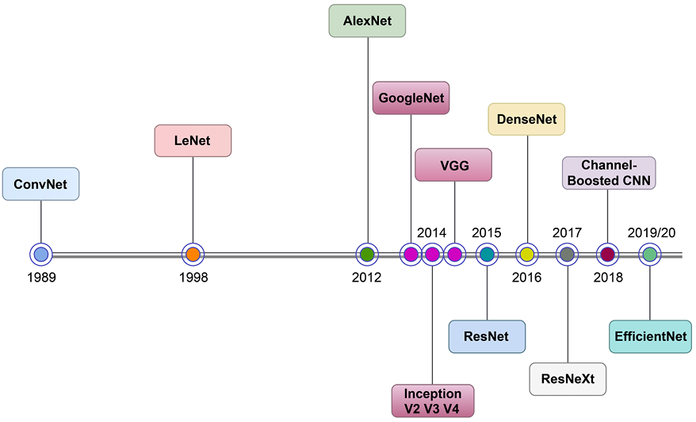
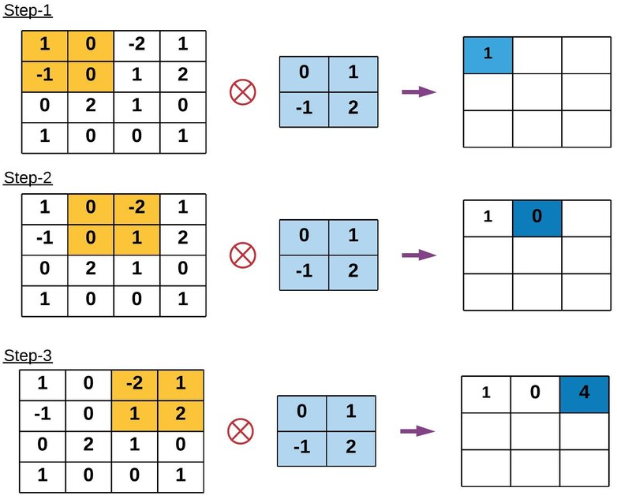
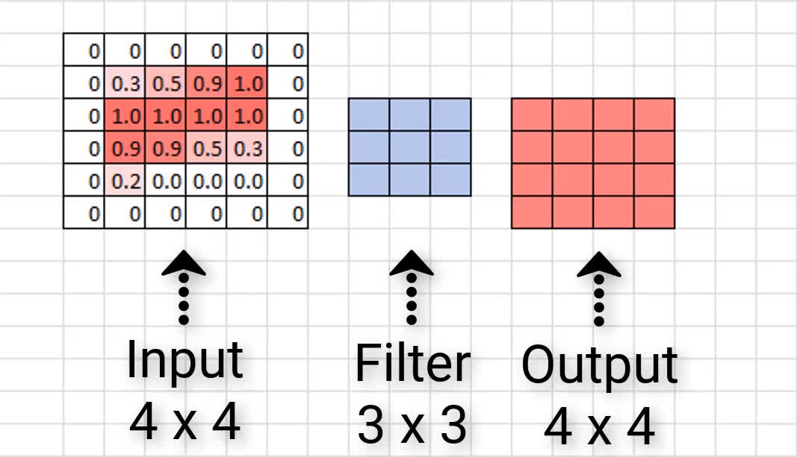
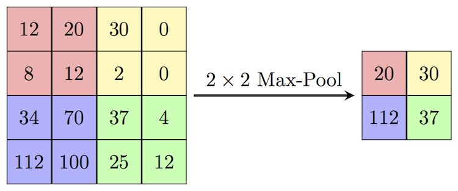
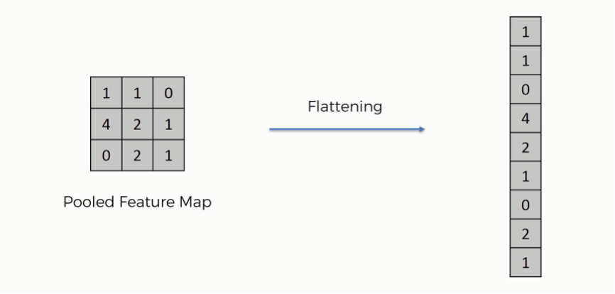
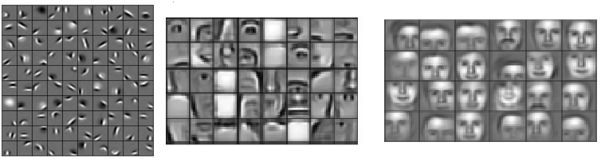
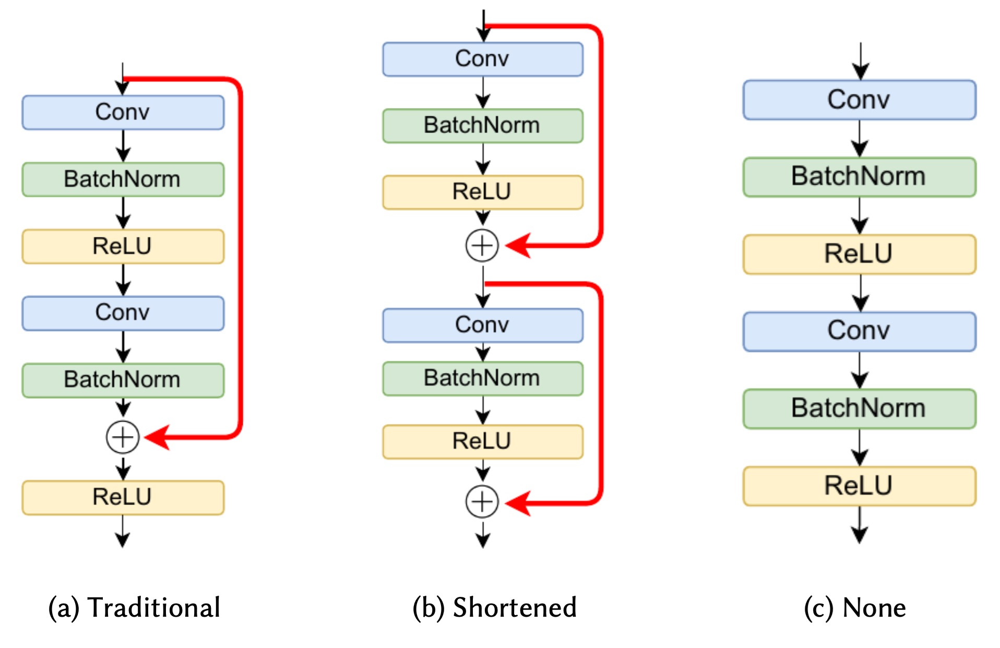
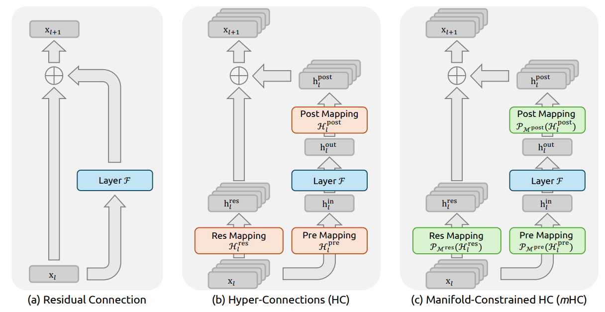

# História

## História - Redes Neurais Convolucionais

A principal inspiração para as redes neurais surgiu de um experimento realizado em 1959 por David Hubel e Torsten Wiesel: *Receptive Fields of Single Neurones in the Cat’s Striate Cortex*.

<figure class="fragment" data-fragment-index="1" 
        style="position:absolute; top:0; left:0; width:100%; margin:0;">
    
  </a>
</figure>

## História - Redes Neurais Convolucionais

O que foi descoberto nesse experimento? 

- Os neurônios no córtex visual respondem a padrões específicos (menos abstratos), como bordas, cantos e cores.
- Descobriu-se que esses neurônios funcionam de forma hierárquica, ou seja, as células mais complexas combinam as mais simples para aprender abstrações maiores.

Esse é exatamente o funcionamento de uma Rede Neural Convolucional

## História - Redes Neurais Convolucionais

Primeira implementação de algo inspirado nesse experimento foi *Neocognitron* (1980) por Kunihiko Fukushima.

<figure class="fragment" data-fragment-index="1" 
        style="position:absolute; top:0; left:0; width:90%; margin:0;">
    
  </a>
</figure>

## História - Redes Neurais Convolucionais

O *ImageNet* surgiu como um grande desafio de classificação de imagens, reunindo milhões de imagens distribuídas em inúmeras classes. Entre 1989 e 1998, Yann LeCun desenvolveu o *LeNet*, considerado a base das CNNs modernas. Até 2012, as taxas de erro na competição ainda eram elevadas. Nesse ano, uma CNN venceu o desafio pela primeira vez com ampla vantagem, marcando o início do domínio das CNNs nas edições seguintes.

## Timeline dos principais acontecimentos no desenvolvimento das CNNs

<figure class="fragment" data-fragment-index="1" 
        style="position:absolute; top:0; left:0; width:100%; margin:0;">
    
  </a>
</figure>

# Introdução

## Motivação

Até agora, vimos os modelos mais simples de Redes Neurais, que são as MLP. Mas porque não utilizar elas para trabalhar com imagens ?

- Número de parâmetros: Como sabemos, é necessário calcular pesos para cada feature, no caso de uma imagem, por exemplo, cada pixel seria uma feature. Ou seja, para cada camada teríamos $n_{pixel} * n_{neuronios}$, o que é um número bem elevado.
- Perda da estrutura espacial, isso porque as MLPs ignoram a vizinhança local
- Sensível a translação, ou seja, se o mesmo objeto aparecer em outro lugar da imagem, isso é um problema para a MLP.

## Ideia Central da CNN

A grande mudança da MLP para a CNN é a introdução de uma nova camada, chamada de camada Convolucional. Essa camada é projetada especificamente para lidar com dados espaciais, na qual é responsável por aprender as features dos dados.
Na prática o que ela faz é aprender Kernels, que nada mais são do que filtros de ativação da imagem.

$$
  Y = X \bigotimes K \leftarrow Y(i,j) = \sum_{m}\sum_{n} X(i+m, j+n) * K(m,n)
$$

## Propriedades das CNNs 

- Perceba que ao aprender um kernel $K$ estamos compartilhando esse peso com toda a rede, então ao invés de aprender uma feature por pixel, agora aprendemos apenas $m * n * k_{filtros}$ features.
- CNNs tem uma propriedade matemática fundamental, conhecida como equivariância por deslocamento, ou seja, quando um objeto da imagem muda de lugar, a representação (feature map) produzida pela rede também se move na mesma quantidade.

## Vizualisando a Convolução

Para facilitar o entendimento vamos ver como essa convolução funciona em um simples exemplo:

<figure class="fragment" data-fragment-index="1" 
        style="position:absolute; top:0; left:0; width:100%; margin:0;">
    
  </a>
</figure>

## Vizualisando a Convolução

<video width="1280" controls>
  <source src="images/ConvolutionVisual.mp4" type="video/mp4">
</video>

## Parâmetros Camadas Convolucionais

Quais são os parâmetros de uma camada convolucional:

- Número de Kernels
- Tamanho do Kernel
- Stride: esse valor define o tamanho do passo que o Kernel delsiza sobre a iamgem durante a convolução, por padrão temos stride igual a $1$.
- Padding: Perceba que quanto maior o tamanho do kernel, menor será a imagem resultante da convolução, e pode ocorrer de querer manter o tamanho da imagem original, para isso usamos padding.

## Parâmetros Camadas Convolucionais

Uma fómrula simples para identificar o tamanho da imagem resultante da convolução é:

$$
  TamanhoResultante = \frac{TamanhoEntrada - TamanhoKernel + (2*Paddingg)}{Stride} + 1
$$

## Padding

Exemplo de padding: Nesse caso, temos uma matriz 4x4 e um filtro 3x3. Perceba que, se fôssemos aplicar normalmente a convolução, teríamos uma saída 2x2. Ao adicionarmos o padding, temos o mesmo tamanho de entrada e saída.

<figure class="fragment" data-fragment-index="1" 
        style="position:absolute; top:0; left:0; width:100%; margin:0;">
    
  </a>
</figure>

# Arquitetura CNN

## Outras camadas

Além da camda convolucional, existem outras 2 camadas camadas muito utilizadsa nas arquiteturas, Pooling (essencial) e flatten. Normalmente temos o seguinte Pipeline de uma arquitetura:

$$
  Input $\rightarrow$ n*(Conv, Activation, Pooling) $\rightarrow$ Flatten $\rightarrow$ Dense $\rightarrow$ Output
$$

## Max Pooling

O funcionamento dessa camada é bem simples de entender. Ele gera um bloco do tamanho desejado e 'desliza' pela imagem, selecionando os maiores valores. Para essa camada, existem 2 parâmetros: tamanho do bloco e o stride.

<figure class="fragment" data-fragment-index="1" 
        style="position:absolute; top:0; left:0; width:100%; margin:0;">
    
  </a>
</figure>

## Flatten

Após a imagem ser processada pelos blocos de convolução o resultado continua sendo uma matriz, normalmente após isso transformamos o resultado em um vetor, pois as camadas densas não lidam com dados bidimensionais. Para isso usamos uma simples camada flatten.

<figure class="fragment" data-fragment-index="1" 
        style="position:absolute; top:0; left:0; width:100%; margin:0;">
    
  </a>
</figure>

## Aprendizagem hierárquica

A CNN assim como o nosso reconhecimento de padrão visual, funciona de forma hierárquica, isso significa que as primeiras camadas aprendem padrões menos abstratos e que vai evoluindo conforme a profundidade da rede, por isso usamos diversos blocos de convolução.

<figure class="fragment" data-fragment-index="1" 
        style="position:absolute; top:0; left:0; width:100%; margin:0;">
    
  </a>
</figure>

# Fundamentos

## Conceitos

- Exploração Espacial: A ideia é utilizar diferentes tamanhos de kernel para explorar diferentes níveis de representações dos dados de entrada
- Profundidade: Refere-se ao número de camadas do modelo
- Largura das CNNs: Refere-se ao número de mapas de features gerados pelas CNNs. 

## Limitações

- Dificuldade com dependências globais (longo alcance)
- Sensibilidade a Variações de Entrada
- Alto custo computacional

# Extra

## Extra: Transfer Learning

Outra propriedade que deixaram as CNNs famosas é a capacidade dalas de transferir aprendizado. Podemos pegar modelos que foram construidos em datasets massivos, como os listados abaixo, e usa-los em outros problemas. Aproveita o conhecimento adquirido até então de outra rede. 

- AlexNet
- ConvNext
- EfficentNet
- GoogLeNet
- ResNet
- Xception
- VGG

## Extra: Skip Connetcion e Residual Connections

Residual Connections e Skip Connections foram criados para permitirem aprendizado de redes mais profundas.

<figure class="fragment" data-fragment-index="1" 
        style="position:absolute; top:0; left:0; width:100%; margin:0;">
    
  </a>
</figure>

## Extra: Skip Connetcion e Residual Connections

Essas conecções possuem as seguintes características:

- Permitem o gradiente fluir diretamente atravessando algumas Camadas
- Mitigam o problema do Vanishing Gradient Problem
- Facilitam a otimização e permite uma convergência mais rápida

## Extra: Hyper Connections

Até recentemente, os estudos sobre Hyper-Connections buscavam aumentar a flexibilidade de redes neurais por meio de conexões parametrizadas mais gerais. No entanto, essas abordagens frequentemente introduziam instabilidade numérica e dificuldades de convergência durante o treinamento.

No início deste ano, o trabalho “mHC: Manifold-Constrained Hyper-Connections”, do grupo da DeepSeek, propôs uma solução mais robusta. A ideia central é impor uma restrição geométrica às hiper-matrizes: em vez de serem arbitrárias, elas passam a pertencer a um espaço estruturado (um manifold). Especificamente, essas matrizes são forçadas a viver no Birkhoff Polytope.

- Basicamente é uma mtriz em que todos os elementos estão entre 0 e 1 e todas as linhas e colunas soma 1.

## Extra: Hyper Connections

<figure class="fragment" data-fragment-index="1" 
        style="position:absolute; top:0; left:0; width:100%; margin:0;">
    
  </a>
</figure>

# Referências

## Referências

- Krichen, Moez. "Convolutional neural networks: A survey." Computers 12.8 (2023): 151.
- Krizhevsky, Alex, Ilya Sutskever, and Geoffrey E. Hinton. "Imagenet classification with deep convolutional neural networks." Advances in neural information processing systems 25 (2012).
- LeCun, Yann, et al. "Gradient-based learning applied to document recognition." Proceedings of the IEEE 86.11 (2002): 2278-2324.
- Fukushima, Kunihiko. "Neocognitron: A self-organizing neural network model for a mechanism of pattern recognition unaffected by shift in position." Biological cybernetics 36.4 (1980): 193-202.
- Hubel, David H., and Torsten N. Wiesel. "Receptive fields of single neurones in the cat's striate cortex." The Journal of physiology 148.3 (1959): 574.

## Referências

- Zhu, Defa, et al. "Hyper-connections." arXiv preprint arXiv:2409.19606 (2024).
- Xie, Zhenda, et al. "mhc: Manifold-constrained hyper-connections." arXiv preprint arXiv:2512.24880 (2025).
- Simonyan, Karen, and Andrew Zisserman. "Very deep convolutional networks for large-scale image recognition." arXiv preprint arXiv:1409.1556 (2014).
- Szegedy, Christian, et al. "Going deeper with convolutions." Proceedings of the IEEE conference on computer vision and pattern recognition. 2015.
- He, Kaiming, et al. "Deep residual learning for image recognition." Proceedings of the IEEE conference on computer vision and pattern recognition. 2016.