# Problemática

## Estabelecendo o problema

Uma das áreas mais antigas da inteligência artificial é o *Natural Language Processing* (NLP). A questão central dessa área é: como aprender padrões tão complexos quanto a linguagem humana?

Considere, por exemplo, a frase: *“Ela não é flor que se cheire”*.

Como devemos interpretar essa frase para compreender seu significado? Nesse contexto, a palavra *“flor”* possui um sentido diferente daquele presente em frases como: *“Ele deu flores para a namorada”*.

Essa dependência de contexto torna os padrões linguísticos significativamente mais complexos.

## Formalmente

Podemos definir formalmente o problema de NLP como:

$$P(x_t\mid x_1, \cdots, x_{t-1})$$

Ou seja, deseja-se modelar a probabilidade de um elemento (x_t) dado o histórico anterior da sequência.

Uma das abordagens clássicas para esse problema são os modelos RNN, LSTM e GRU, projetados especificamente para lidar com dados sequenciais. Nessas arquiteturas, o estado atual depende do estado anterior, permitindo que a informação seja propagada ao longo do tempo. A ideia geral pode ser representada por:

$$h_t = f(x_t, h_{t-1})$$

## Problemas da RNNs

Ao longo dos anos, diversas abordagens buscaram resolver a principal limitação desses modelos: a dificuldade em capturar dependências de longo prazo. Isso ocorre porque informações relevantes no início da sequência tendem a se perder ao longo do processamento, enquanto os gradientes diminuem exponencialmente durante o treinamento.

Considere a frase: *“O livro do professor que o aluno admira é complexo.”*

Para relacionar *“livro”* com *“complexo”*, o modelo precisa atravessar múltiplas dependências intermediárias. Modelos recorrentes, como RNNs, possuem dificuldade em preservar esse tipo de informação ao longo da sequência.

## Problemas da RNNs

O principal problema se deve que a RNN é inerentemente sequencial:

$$
  h_1 \rightarrow h_2 \rightarrow h_3 \rightarrow \cdots
$$

Isso faz com que o treinamento seja lento e as derivadas dependam de múltiplas multiplicações de matrizes.

## Objetivo do Transformers

Para resolver esse problema, surgiu a ideia de construir *embeddings contextuais*, nos quais cada palavra pode assumir diferentes representações vetoriais dependendo do contexto em que aparece. Dessa forma, o significado de uma palavra passa a depender das demais palavras ao seu redor. Para computar essas representações contextuais, utiliza-se o mecanismo de *atenção* (*attention*).

<figure class="fragment" data-fragment-index="1" 
        style="position:absolute; top:0; left:0; width:70%; margin:0;">
    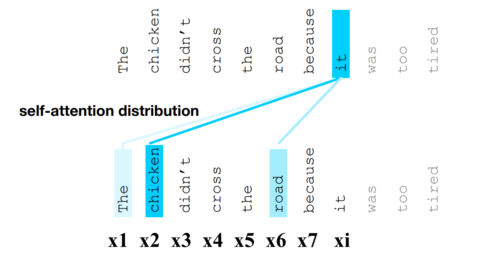
  </a>
</figure>

# Arquitetura do Transformer

## Como funciona um Transformer  

A arquitetura do modelo pode ser vista na imagem abaixo. A principal novidade é o *Multi Head Attention*. Para entender como ele funciona, vamos ver um exemplo usando texto.  

<figure class="fragment" data-fragment-index="1" 
        style="position:absolute; top:0; left:0; width:100%; margin:0;">
    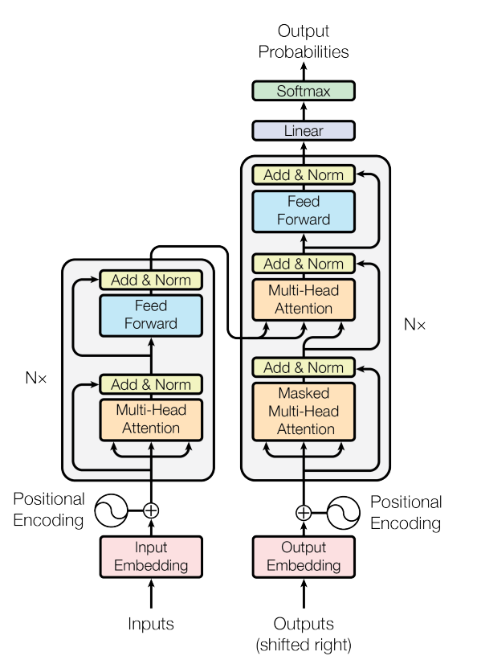
  </a>
</figure>

## Input Embedding

O primeiro passo é o *Input Embedding*, no qual as palavras são representadas em um novo espaço vetorial. Nesse processo, cada palavra é associada a um vetor, por exemplo, de dimensão 512. Essa representação é importante porque codificações simples, como *“Carro = 1”* e *“Porta = 2”*, não capturam o significado semântico das palavras. Além disso, palavras semanticamente semelhantes não necessariamente possuem valores próximos nesse tipo de representação discreta. Com *embeddings*, palavras com significados relacionados tendem a possuir representações vetoriais mais próximas entre si.

## Input Embedding

<figure class="fragment" data-fragment-index="1" 
        style="position:absolute; top:0; left:0; width:100%; margin:0;">
    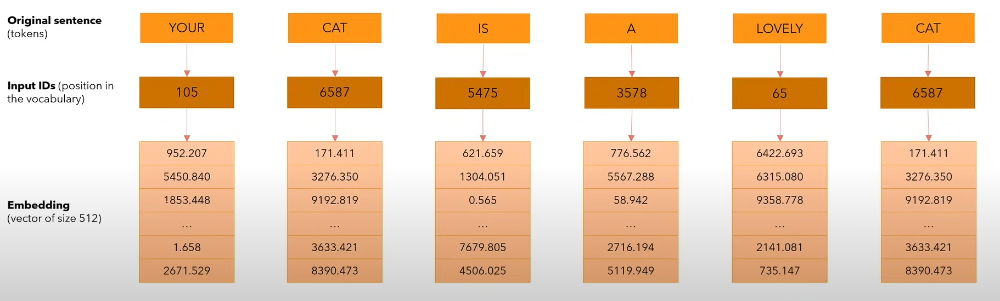
  </a>
</figure>

## Positional Encoding

Para um texto, queremos carregar a informação sobre a posição de uma palavra na frase e saber quais são as palavras mais próximas e mais distantes na frase, para isso usamos *positional encoding*.
Quando formos ver a parte de atenção, vamos ver a importância do *positional encoding* porque ela não se importa com a posição, sendo assim precisamos de alguma forma incorporar isso nas representações. 

<figure class="fragment" data-fragment-index="1" 
        style="position:absolute; top:0; left:0; width:100%; margin:0;">
    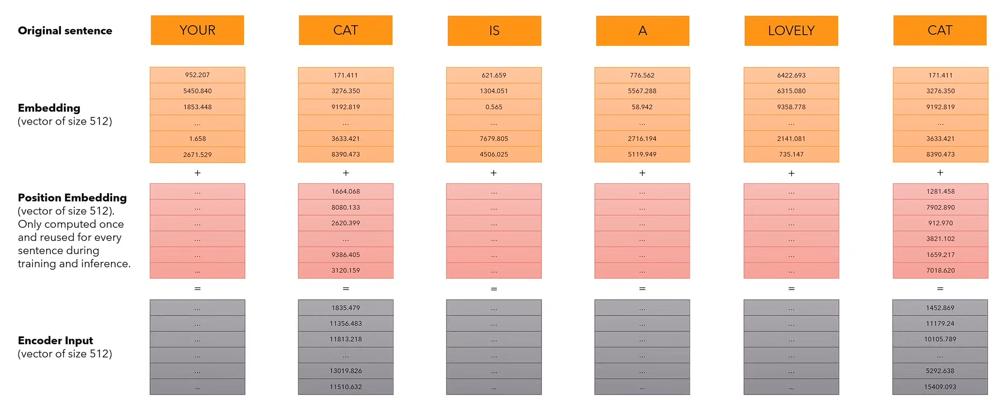
  </a>
</figure>

## Positional Encoding

Para calcular o *position encoding* vamos usar a fómrula definida no artigo original. Que utiliza fórmulas trigonométricas como seno e cosseno para capturar padrões contínuos e periódicos.

<figure class="fragment" data-fragment-index="1" 
        style="position:absolute; top:0; left:0; width:100%; margin:0;">
    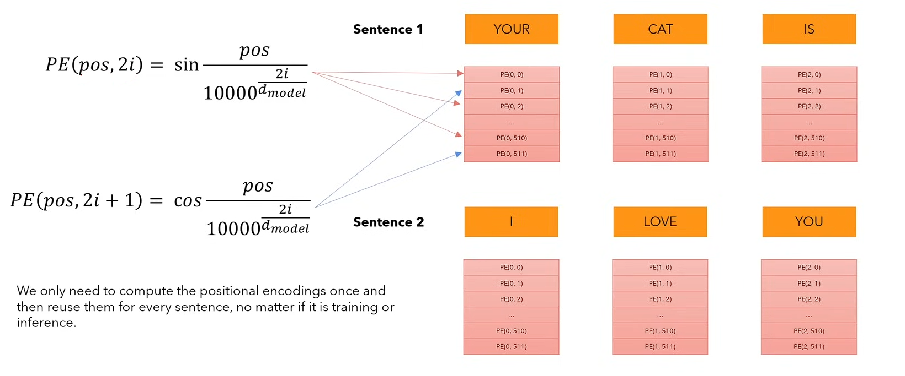
  </a>
</figure>

## Self-Attention

Antes de analisar o *Multi-Head Attention*, é importante compreender o funcionamento do *Self-Attention* (ou *Single-Head Attention*).

A atenção é um mecanismo que permite à rede neural aprender relações entre diferentes partes da entrada. Sua formulação é dada por:

$$Attention(Q, K, V) = softmax\left(\frac{QK^T}{\sqrt{d_k}}\right)V$$

O termo $QK^T$ representa o produto escalar entre *queries* e *keys*, medindo o grau de similaridade entre elas. A divisão por $\sqrt{d_k}$ é utilizada para evitar a saturação da função *softmax*, que é aplicada linha a linha para gerar os pesos de atenção.

## Self-Attention

Mas o que representam $Q$, $K$ e $V$? Esses termos correspondem a projeções lineares aprendidas durante o treinamento da rede: $Q = XW_Q$, $K = XW_K$ e $V = XW_V$ em que $X$ representa a entrada da camada, enquanto $W_Q$, $W_K$ e $W_V$ são matrizes de pesos treináveis. Temos:

* $Q, K \in \mathbb{R}^{n \times d_k}$
* $V \in \mathbb{R}^{n \times d_v}$

Consequentemente: $QK^T \in \mathbb{R}^{n \times n}$ e $Attention \in \mathbb{R}^{n \times d_v}$

O produto $QK^T$ produz uma matriz de similaridade entre os elementos da sequência, enquanto a saída final da atenção corresponde a uma combinação ponderada dos vetores $V$.

## Intuição $Q$, $K$, $V$

Podemos interpretar o mecanismo de atenção como um sistema de busca:

* **Query (Q):** representa o que está sendo procurado.
* **Key (K):** representa o que cada palavra oferece.
* **Value (V):** representa a informação associada a cada palavra.

Para cada elemento da sequência:

1. Comparamos $Q$ com todas as $K$.
2. Calculamos pesos de relevância (*attention weights*).
3. Produzimos uma combinação ponderada dos vetores $V$.

## Self-Attention
Ao utilizarmos *softmax* garantimos que a soma resultante de cada linha na matriz seja $1$. Podemos considerar esses valores como um score.

<figure class="fragment" data-fragment-index="1" 
        style="position:absolute; top:0; left:0; width:100%; margin:0;">
    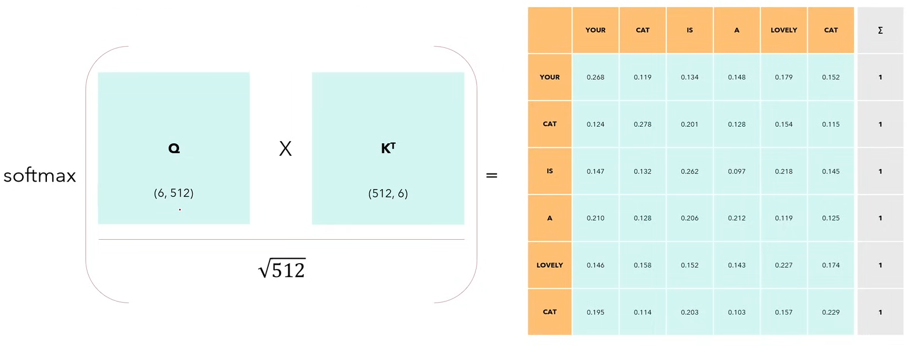
  </a>
</figure>

## Self-Attention
A matriz produzida pelo mecanismo de *Self-Attention* é capaz de capturar não apenas o significado representado pelos *embeddings* e a posição fornecida pelo *Positional Encoding*, mas também as interações entre cada palavra da sequência.

<figure class="fragment" data-fragment-index="1" 
        style="position:absolute; top:0; left:0; width:100%; margin:0;">
    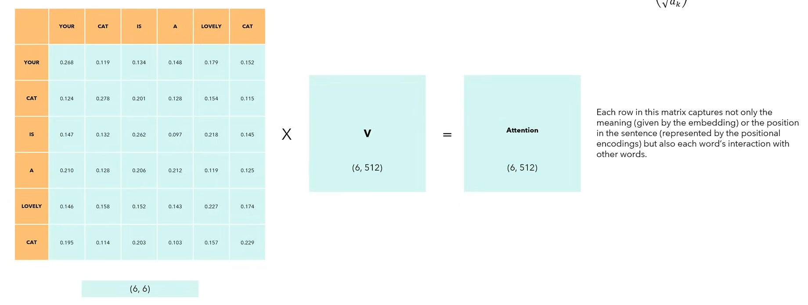
  </a>
</figure>

## Multi Head Attention

Entretanto, a linguagem natural é complexa demais para ser modelada por apenas um mecanismo de *Self-Attention*, já que diferentes tipos de padrões podem existir simultaneamente. Por esse motivo, utilizamos múltiplas *heads* de atenção em paralelo. Cada *head* aprende representações em diferentes subespaços, permitindo capturar distintos tipos de relações, como dependências sintáticas, concordância gramatical e relações semânticas. Cada *head* é definida por:

$$head_i = Attention(QW_i^Q, KW_i^K, VW_i^V)$$

A saída final do mecanismo de *Multi-Head Attention* é obtida pela concatenação de todas as *heads*:

$$MultiHead = Concat(head_1, \cdots, head_h)W^O$$

## Multi Head Attention

<figure class="fragment" data-fragment-index="1" 
        style="position:absolute; top:0; left:0; width:100%; margin:0;">
    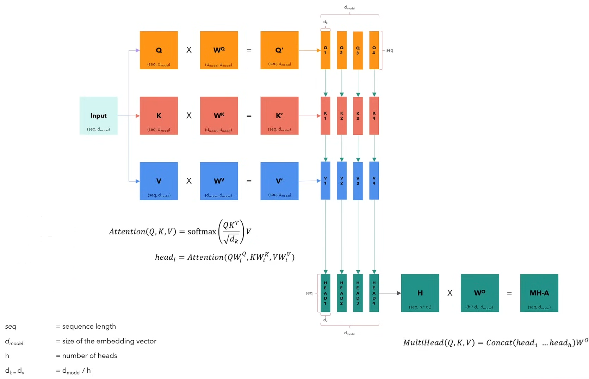
  </a>
</figure>

## Bloco do Transformer

Cada bloco do encoder segue as seguintes camadas:

1. Multi-Head Attention  
2. Conexão Residual e Normalização  
3. Camada Densa  
4. Conexão Residual e Normalização  

Isso é repetido várias vezes ao longo da rede.

## Observação importante: Máscara

Na prática nós mascaramos os valores do triangulo da matriz formado pela multiplicação da query e da key. Motivo é para a palavra que estamos analisando 
não ter informação sobre o "futuro", ou seja das palavras que sucedem ela.

$$
    Attention(Q, K, V) = softmax\left(mask\left(\frac{QK^T}{\sqrt{d_k}}\right)\right)V
$$

## Observação importante: Máscara

<figure class="fragment" data-fragment-index="1" 
        style="position:absolute; top:0; left:0; width:100%; margin:0;">
    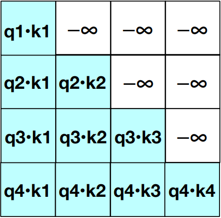
  </a>
</figure>

# ViT

## História

Por muitos anos, as Redes Neurais Convolucionais (CNNs) dominaram a área de visão computacional, alcançando resultados expressivos. Em 2017, foi publicado um dos artigos mais influentes de redes neurais profundas, *“Attention is All You Need”*, que introduziu uma nova abordagem baseada exclusivamente em mecanismos de atenção. Uma das principais capacidades da arquitetura Transformer é capturar relações globais entre os elementos da entrada.

Motivado por esse avanço, em 2021 foi proposta uma nova abordagem para visão computacional: o *Vision Transformer (ViT)*.

## Arquitetura

O *Vision Transformer* (ViT) pode ser entendido como uma extensão da arquitetura Transformer apresentada anteriormente. Nesse modelo, utiliza-se apenas a etapa de *encoding* do Transformer original. A arquitetura de um ViT pode ser observada na figura abaixo. A seguir, analisaremos cada um de seus componentes individualmente.

<figure class="fragment" data-fragment-index="1" 
        style="position:absolute; top:0; left:0; width:80%; margin:0;">
    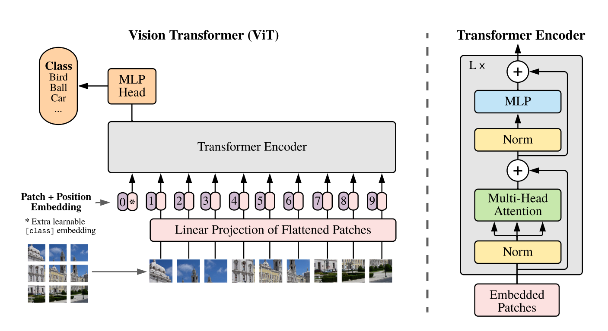
  </a>
</figure>

## Patching

Uma característica importante do *Vision Transformer* é que ele foi originalmente desenvolvido para operar sobre sequências, como textos. Dessa forma, surge a seguinte questão: como representar imagens como sequências?

Para isso, o ViT divide a imagem em pequenos blocos, chamados *image patches*.

<figure class="fragment" data-fragment-index="1" 
        style="position:absolute; top:0; left:0; width:100%; margin:0;">
    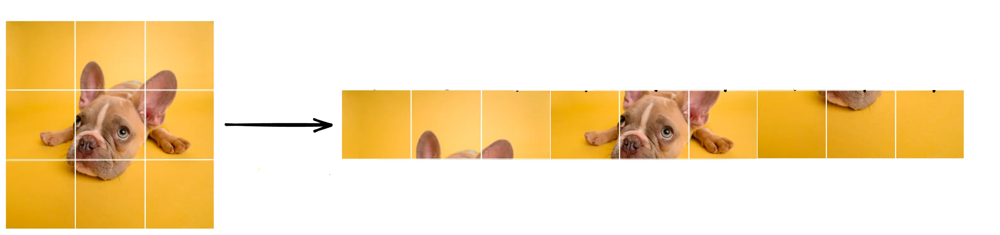
  </a>
</figure>

## Funções Importantes

* Após a divisão da imagem em *patches*, a primeira etapa do ViT é a construção dos *embeddings*. Na prática, isso é feito aplicando uma projeção linear sobre cada *patch*, geralmente utilizando uma MLP ou uma CNN para gerar as representações vetoriais.

* Assim como nos Transformers aplicados a texto, também é utilizado um *Positional Embedding*. No ViT, porém, os valores associados ao posicionamento não são definidos por funções trigonométricas fixas; eles são tratados como parâmetros aprendidos durante o treinamento do modelo.

## Token especial

No ViT existe um patch adicional chamado de class token (CLS token), resumo de toda a imagem. Esse patch adicional começa como uma matriz de valores aleatórios e os pesos são aprendidos ao longo do treinamento. Normalmente utilizamos ele para predição da classe de uma imagem.

## CNN x ViT:

- Na CNN, os filtros enxergam apenas uma pequena região da imagem por vez. Para capturar informações globais, são necessárias várias camadas, enquanto o ViT modela as relações globais desde o início, pois o multi head attention conecta qualquer pixel a qualquer outro, independentemente da posição.
- A CNN processa a imagem como um todo, aplicando convoluções sucessivas na imagem, enquanto o ViT divide as imagens em patches e trata cada um como um 'token'.
- A CNN tem um forte viés indutivo porque possui a característica de ser invariante translacional, enquanto o ViT não tem um viés indutivo forte. Isso faz com que o ViT precise de mais dados para treinamento do que uma CNN.

# Referências

## Referências

- Vaswani, Ashish, et al. "Attention is all you need." Advances in neural information processing systems 30 (2017).
- Lin, Tianyang, et al. "A survey of transformers." AI open 3 (2022): 111-132.
- Dosovitskiy, Alexey, et al. "An image is worth 16x16 words: Transformers for image recognition at scale." arXiv preprint arXiv:2010.11929 (2020).

## Referências

- Jumper, John, et al. "Highly accurate protein structure prediction with AlphaFold." nature 596.7873 (2021): 583-589.
- Lee, Seung Hoon, Seunghyun Lee, and Byung Cheol Song. "Vision transformer for small-size datasets." arXiv preprint arXiv:2112.13492 (2021).