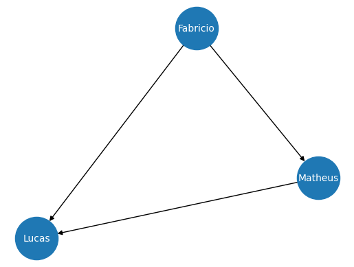
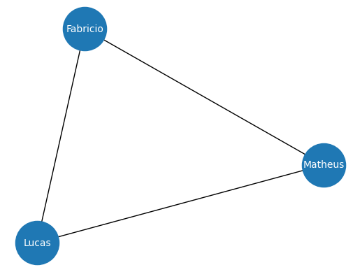
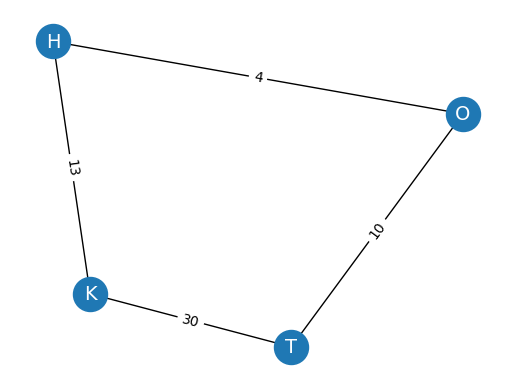

# Conceitos Fundamentais

## Grafos

Grafos nada mais são do que representações de uma coleção de nós (vértices) e arestas que conectam esses nós, formando uma estrutura que representa as relações entre os nós.

$$
  G = (V, E)
$$

<div style="position: relative; width: 45%; height: 500px; margin: auto; text-align:center;">
<figure class="fragment" data-fragment-index="1" 
        style="position:absolute; top:0; left:0; width:100%; margin:0;">
    
  </a>
</figure>
</div>

A partir de um grafo é possível representar um sistema complexo como: Estrutura de um programa, Sistema Físico e dentra da bilogia temos inúmeros exemplos, Caminhos Metabólicos, Redes Regulatórias, etc .

## Aprendizado baseado em Grafos

A partir da união das redes neurais com os grafos podemos resolver diversos tipos de problemas:

- Classificação de Nós: Predizer a categoria de um nó
- Predição de um Link: Predizer link entre nós que estão faltando
- Classificação do Grafo: A partir de todo o grafo predizer uma categoria para ele
- Geração de Grafo: Assim como dados sintéticos, é possível gerar grafos sintéticos, ou seja, novos grafos a partir de algum propriedade que esteja nos outros grafos (principal aplicação é gerar novas moléculas para descoberta de novos medicamentos)

## Grafos Direcionados e Não direcionados

Nos Grafos direcionados, cada vértice possue uma direção, ou seja, ele liga os nós em um direção específica, ao contrário dos grafos não direcionados.

```
# Criando grafo Direcionado
import networkx as nx
G = nx.DiGraph()
G.add_edges_from([('Fabricio', 'Matheus'), ('Fabricio', 'Lucas'), ('Matheus', 'Lucas')])
```

<div style="position: relative; width: 50%; height: 500px; margin: auto; text-align:center;">
<figure class="fragment" data-fragment-index="1" 
        style="position:absolute; top:0; left:0; width:100%; margin:0;">
    
  </a>
</figure>
</div>


## Grafos Direcionados e Não direcionados

```
# Criando um grafo não direcionado
Z = nx.Graph()
Z.add_edges_from([('Fabricio', 'Matheus'), ('Fabricio', 'Lucas'), ('Matheus', 'Lucas')])
```

<div style="position: relative; width: 60%; height: 500px; margin: auto; text-align:center;">
<figure class="fragment" data-fragment-index="1" 
        style="position:absolute; top:0; left:0; width:100%; margin:0;">
    
  </a>
</figure>
</div>

## Grafos ponderados

```
# Criando um grafo ponderado
GP = nx.Graph()
GP.add_edges_from([('H', 'O', {"weight": 4}), ('H', 'K', {"weight": 13}),
                   ('K', 'T', {"weight": 30}), ('T', 'O', {"weight": 10})])
labels = nx.get_edge_attributes(GP, "weight")
```

<div style="position: relative; width: 60%; height: 500px; margin: auto; text-align:center;">
<figure class="fragment" data-fragment-index="1" 
        style="position:absolute; top:0; left:0; width:100%; margin:0;">
    
  </a>
</figure>
</div>

## Grafos Conectados e Disconectados

Um grafo é dito conectado se existe um caminho entra quaisquer dois vértices do grafo, caso contrário, o grafo é dito desconectado.

```
# Verificando se um grafo é conectado
G = nx.Graph()
G.add_edges_from([(1, 3), (3, 4), (4, 1), (5, 6)])
print(f"O grafo está conectado ? {nx.is_connected(G1)}")
```

## Degrau e Vizinhança

- Degrau de um nó: Número de vértices incidentes no nó (uma aresta é insidente em um nó, se o nó é um dos endpoints da aresta).
- Se o grafo for direcionado então temos degrau interno (número de arestas que chegam no nó) e o degrau externo (número de arestas que saem do nó).
- Ciclo: Um caminho em que o primeiro e o último vértice vizitado são os mesmos
- Vizinhos: Sâo os Nós diretamente conectados a um nó particular. Dois nós são ditos adjacentes se estão diretamente ligados através de uma aresta.

```
# Verificando se um grafo é conectado
Z = nx.Graph()
Z.add_edges_from([('Fabricio', 'Matheus'), ('Fabricio', 'Lucas'), ('Matheus', 'Lucas')])
print(f"Degrau(Lucas) = {Z.degree['Lucas']}")
```

## Medidas de um grafo 

- Grau de Centralidade: Mais simples, usa apenas o degrau do nó, quanto maior o valor maior o indicativo que o vértice é altamente conectado com os outros vértices do grafo, e assim, influência a rede.
- Centralidade de proximidade: Mede o quão próximo um nó está dos outros nós da rede (média da distância entre os caminhos mais curtos do nó até os outros nós da rede)
- Centralidade de intermediação: Mede quantas vezes um nó está em um dos caminhos mais curtos entre dois nós (alto valor indica que o nó funciona como uma ponte entre diferentes nós)

## Medidas de um grafo 

Grau:

$$
  C_D(v) = \frac{deg(v)}{|V|-1}
$$

Proximidade:

$$
  C_C(v) = \frac{1}{\sum_u d(v,u)}
$$

Intermediação:

$$
  C_B(v) = \sum_{s,t} \frac{\sigma_{st}(v)}{\sigma_{st}}
$$

## Medidas de um grafo

```
print(f"Grau de Centralidade = {nx.degree_centrality(G)}")
print(f"Centralidade de proximidade = {nx.closeness_centrality(G)}")
print(f"Centralidade de intermediação= {nx.betweenness_centrality(G)}")
```

## Representação matriz adjacente

Uma matriz adjacente representa as arestas do grafo, indicando onde existe uma aresta entre dois nós. A matriz tem tamanho $n \times n$, onde $n$ é o número de nós do grafo. O valor de $1$ na célula $(i,j)$ indica que existte uma aresta entre os nós $i$ e $j$, caso contrário o valor indicado é $0$.

<div style="position: relative; width: 50%; height: 500px; margin: auto; text-align:center;">
<figure class="fragment" data-fragment-index="1" 
        style="position:absolute; top:0; left:0; width:100%; margin:0;">
    
  </a>
</figure>
</div>

# Criando Representações de Nós - DeepWalk

## Word2Vec

A ideia do Word2Vec é o que vai trazer a base de como funciona os modelos baseados em grafo. O que queremos no fim usando o Word2Vec é transformar uma palavra em um vetor, criando uma nova representação. Esse é um objetivo semelhante ao que queremos fazer no grafo, que é criar representações significativas dele.

$$
  v_i \rightarrow z_i \in \mathbb{R}^d
$$

## Word2Vec

Um exmeplo do que pode ser feito é:

$$
  vec(ator) = [-2, 3, 1]
  vec(atriz) = [-1.9, 2, 1.5]
  vec(homem) = [3, -1, -2]
  vec(mulher) = [2.5, -2.5, -1] 
$$  

Uma forma de medir a semelhança é usando a similaridade de cosseno:

$$
  \text{similaridade de cosseno} = \frac{A \dot B}{||A|| \dot ||B||}
$$

Com isso coisas é possível calcular coisas como $vec(ator) - vec(homem) + vec(mulher) \approx vec(atriz)$

## Word2Vec - Skip-grams e CBOW

Duas principais formas de fazer o Word2Vec é com CBOW e Skip-gran. o CBOW usa as palavras e o contexto ao seu redor para predizer uma palavra. Enquanto o Skip-gran tenta predizer o contexto a partir de uma palavra.

Skip-gran é implementado utilizando um par de palavras $(input, contexto)$, na qual o $contexto$ é a palavra que queremos predizer.

## Skip-grams

Dado o tamanho do vetor de contexto $C$, queremos maximizar a probablidade de ver o contexto dado a palavra de input:

$$
  \frac{1}{N}\sum_{n=1}^N \sum_{-C \leq j \leq C} log p(w_{n+j}|w_n)
$$

A probabilidade é computada pelo softmax do embeding do contexto $h_c$ dado o embedding do input $h_t$:

$$
  p(w_c|w_t) = \frac{exp(h_c h_t^T)}{\sum_{i=1}^{|V|}exp(h_i h_t^T)}
$$

## Skip-grams

Um skip-gram possui 2 camadas, uma de projeção linear com a matriz de peso $W_{embed}$, que recebe o one-hot encoded das palavras e depois uma camada densa com a matriz de pesos $W_{output}$.

Então temos os passos:

- 1° embedding: $h = W^t_{embed} \dot x$
- 2° camada densa com softmax: $p(w_c|w_t) = \frac{exp(W_{output} \dot h)}{\sum_{i=1}^{|V|}exp(W_{output_{i}} \dot h)}$

## DeepWalk - Random Walks

O objetivo de criar representações uteis se mantem com DeepWalk, mas ao invés de usar palavras, usamos nós. A partir disso usamos um algoritimo conhecido como random walk para gerar sequências significativas dos nós, que funcionam como sequência.  

Toda a ideia consiste em o Random Walk serem sequências produzidas apartir da escolha aleatória dos vizinhos a cada etapa. Então se os nós costumam aparecer em conjunto isso indica que eles são proximos de alguma forma.

## DeepWalk

DeepWalk nada mais é do que a combinação do Random Walk com o Word2Vec

<div style="position: relative; width: 100%; height: 500px; margin: auto; text-align:center;">
<figure class="fragment" data-fragment-index="1" 
        style="position:absolute; top:0; left:0; width:100%; margin:0;">
    
  </a>
</figure>
</div>

## Exemplo DeepWalk

Referência: https://www.mdpi.com/2227-9059/13/3/536

<div style="position: relative; width: 70%; height: 500px; margin: auto; text-align:center;">
<figure class="fragment" data-fragment-index="1" 
        style="position:absolute; top:0; left:0; width:100%; margin:0;">
    
  </a>
</figure>
</div>

# Incluindo Features nos Nós - Introdução a GNN

## Incluindo Features nos Nós - Introdução a GNN

Até agora consideramos apeans a topologia do grafo. Contudo, os grafos tendem a ser mais ricos do que apenas conexões, tanto os nós, quanto as arestas,
podem ter features. 

Para isso vamos usar o dataset Cora, que representa 2708 publicações, onde a conexão são as referências. Cada publicação é descrita como um vetor binario de 1433 palavras unicas. O objetivo é classificar o nó em uma das 7 categorias.

## Primeiro Graph Neural Network

No modelo tradicional de rede neural podemos fazer $h_A = x_A W^T$, onde $x_A$ era o input do vetor de $A$ e $W$ era a matriz de peso. Qual o problema, em um grafo os vetores de entrada são as features dos nós, isso significa que os nós estão completamente separados um dos outros. Para usar a informação da topologia e ao mesmo tempo das features, precisamos olhar para sua vizinhança.

Graph Linear Layer:

$$
  h_a = \sum_{i \in \mathcal{N}_A} x_i W^T
$$

## Primeiro Graph Neural Network

Por questão de eficiência como temos a matirz adjacência é muito mais simples e rápido computar:

$$
  H = \widetilde{A}^T X W^T
$$

Em que $\widetilde{A} = A + I$, para computar o próprio nó.

## Graph Linear Layer:

```
class GNNLayer(torch.nn.Module):
    def __init__(self, dim_in, dim_out):
        super().__init__()
        self.linear = Linear(dim_in, dim_out, bias=False)

    def forward(self, x, adjacency):
        x = self.linear(x)
        x = torch.sparse.mm(adjacency, x)
        return x
```

# Graph Convolutional Network

## Graph Convolutional Network

Esse conceito foi introduzido por Kipf e Welling em 2017, a ideia é criar uma variante da CNNs para as GNNs. Assim como no caso das CNNs, as GCNs se tornaram as redes de GNN mais populares. 

## Limitações no nosso modelo

O nosso modelo tem uma limitação muito evidente, vamos verificar novamente como é feito o cálculo:

$$
  h_i = \sum_{j \in \mathcal{N}_i} x_j W^T
$$

Perceba que não é levado em consideração o número de vizinhos, ou seja se um nó possui 1 vizinho e outro 100, não existe uma normalização, logos os valores vão ficar muito discrepantes. 

## Solucionando o problema

Uma forma de resolver esse problema é simplesmente normalizar pelo degrau do nó.

$$
  h_i = \frac{1}{deg(i)} \sum_{j \in \mathcal{N}_i} x_j W^T
$$

## Normalização Matricial

Para transformar aquela normalização em multiplicação de matrizes, utilizamos a matriz degrau, que conta o número de vizinhos por nó. Com isso existe duas formas de normalização:

- $\widetilde{D}^{-1} \widetilde{A} X W^T$ irá normalizar cada linha das features, fazendo com que a maginitude de um nó com muitos vizinhos não exploda.
- $\widetilde{A} \widetilde{D}^{-1} X W^T$ irá normalizar cada coluna das features. Isso faz com que cada nó distribua sua informação igualmente entre seus vizinhos (nós de alto grau não domina os outros).

## Normalização Matricial

A GCN utiliza uma normalização híbrida, com isso temos a GCN final:

$$
  H = \widetilde{D}^{-\frac{1}{2}} \widetilde{A} \widetilde{D}^{-\frac{1}{2}} X W^T
$$

## Graph Attention Network

As GATs são uma melhoria teórica das GNNs. Além de uma normalização estática, ela propõe fatores de ponderação calculados pela importância de cada nó usando self-attention.

Podemos chamar esses fatores de ponderação de scores de atenção $\alpha_{ij}$, com isso temos o graph attention:

$$
  h_i = \sum_{j \in \mathcal{N}_i} \alpha_{ij} W x_j
$$

## Transformação Linear

Os scores de atenção calcula a importância entre o nó central $i$ e o vizinho $j$. Na camada de atenção do grafo, isso é representado pela concateção dos vetores $[Wx_i || Wx_j]$:

$$
  a_{ij} = W_{att}^T[Wx_i || Wx_j]
$$

Após isso é aplicado uma função de ativação LeakyRelu e uma softmax:

$$
  e_{ij} = LeakyRelu(a_{ij})
  \alpha_{ij} = softmax(e_{ij}) = \frac{exp(e_{ij})}{\sum_{k \in \mathcal{N}_i} exp(e_{ik})}
$$

## Multi-head attention

Como já vimos na aula passada normalmente não usamos self-attention e sim multi-head attention. Existe duas formas de fazer isso na GAT:

- Média: A ideia é somar os diferentes embeddigs gerados e depois normalizar pelo número de heads $n$.
$h_i = \frac{1}{n}\sum_{k=1}^n \sum_{j \in \mathcal{N}_i} \alpha_{ij}^k W^k x_j$
- Concatenação: Concatena os diferentes embeddins, produzindo uma matriz maior.
$h_i = ||^n_{k=1}\sum_{j \in \mathcal{N}_i} \alpha_{ij}^k W^k x_j$

Uma regra simples para saber qual usar é: Se está em uma camada intermediaria utilize concateção, quando é a última camada da rede então média.

## Melhoria na GAT

Uma segunda versão do GAT foi proposta (Brody et al. 2021) para permitir uma maior expressão da GAT, isso porque ao invés de aplicar a atenção na transformação linear do input ela é aplicado depois, assim fica:

Antes:

$$
  \alpha_{ij} = \frac{exp(LeakyRelu(W_{att}^t [Wx_i||Wx_j]))}{\sum_{k \in \mathcal{i}} exp(LeakyRelu(W_{att}^t [Wx_i||Wx_k]))}
$$

Depois:

$$
  \alpha_{ij} = \frac{exp(W_{att}^t \dot LeakyRelu(W[x_i||x_j]))}{\sum_{k \in \mathcal{i}} W_{att}^t \dot exp(LeakyRelu(W[x_i||x_k]))}
$$

# GraphSAGE

## GraphSAGE

GraphSAGE (Hamilton et.al 2017) é uma GNN feita  para lidar com grandes grafos. Na biologia normalmente temos que lidar com escabalabidade, por causa da quantidade de dados que temos. Contudo tanto GCN, quanto GAT não são preparados para isso. GraphSAGE traz duas ideias novas:

- Amostragem de Vizinho
- Operações de Agregação

## Amostragem de Vizinho

Nas primeiras aulas falamos sobre os batches, e como os otimizadores utilizam eles. Contudo, a maior parte dos datasets daquelas redes neurais são fáceis de extrair um batch, no caso de um dado tabular temos uma linha, no caso de imagens temos uma imagem, etc. 
Como realizar amostragem a partir de um grafo ? 

## Amostragem de Vizinho

A ideia consiste 2 etapas: 1° quando fazemos o embedding the nó, usamos apenas seus vizinhos. Isso significa que para computa-los só precisa dos vizinhos diretos (1 hope), se a GNN tiver 2 camadas então precisa dos vizinhos dos vizinhos (2 hops) e assim por diante.

<div style="position: relative; width: 40%; height: 500px; margin: auto; text-align:center;">
<figure class="fragment" data-fragment-index="1" 
        style="position:absolute; top:0; left:0; width:100%; margin:0;">
    
  </a>
</figure>
</div>

## Amostragem de Vizinho

Contudo, a computação do grafo se torna muito grande a medida que aumenta o numero de hops e se o degrau do nó for muito elevado. Para o segundo caso uma forma de resolver é fazendo amostragem de vizinhos:

<div style="position: relative; width: 50%; height: 500px; margin: auto; text-align:center;">
<figure class="fragment" data-fragment-index="1" 
        style="position:absolute; top:0; left:0; width:100%; margin:0;">
    
  </a>
</figure>
</div>

## Operação de agregação

A operação de agregação é somente para verificar qual operação usar para computar os embeddings, no artigo original 3 operações foram apresentadas:

- Agregador da média
- Agregador de long short-term memory (LSTM)
- Agregador de pooling

Vamos usar o agregador da média:

$$
  h_i = \sigma(W \dot mean_{j \in \mathcal{N}_i}(h_j))
$$

# Referências

## Referências

- Kipf, Thomas N., and Max Welling. "Semi-supervised classification with graph convolutional networks." arXiv preprint arXiv:1609.02907 (2016).
- Veličković, Petar, et al. "Graph attention networks." arXiv preprint arXiv:1710.10903 (2017).
- Brody, Shaked, Uri Alon, and Eran Yahav. "How attentive are graph attention networks?." arXiv preprint arXiv:2105.14491 (2021).
- Rossi, Emanuele, et al. "Temporal graph networks for deep learning on dynamic graphs." arXiv preprint arXiv:2006.10637 (2020).
- Pearson, Karl. "The problem of the random walk." Nature 72.1867 (1905): 342-342.

## Referências

- Hamilton, Will, Zhitao Ying, and Jure Leskovec. "Inductive representation learning on large graphs." Advances in neural information processing systems 30 (2017).
- Zhou, Jie, et al. "Graph neural networks: A review of methods and applications." AI open 1 (2020): 57-81.
- Perozzi, Bryan, Rami Al-Rfou, and Steven Skiena. "Deepwalk: Online learning of social representations." Proceedings of the 20th ACM SIGKDD international conference on Knowledge discovery and data mining. 2014.
- Grover, Aditya, and Jure Leskovec. "node2vec: Scalable feature learning for networks." Proceedings of the 22nd ACM SIGKDD international conference on Knowledge discovery and data mining. 2016.

