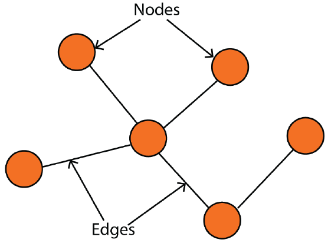
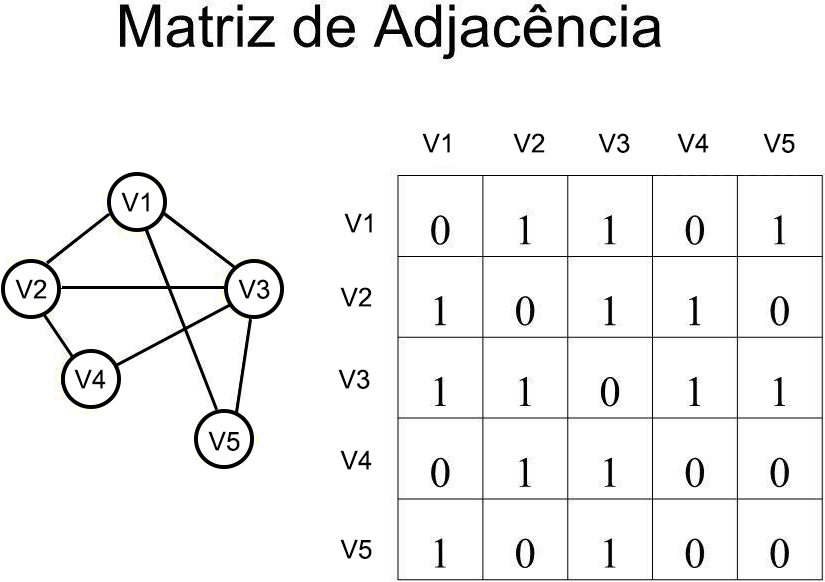
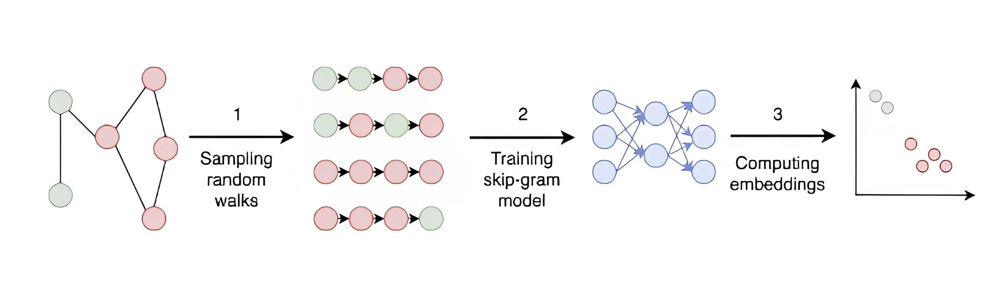
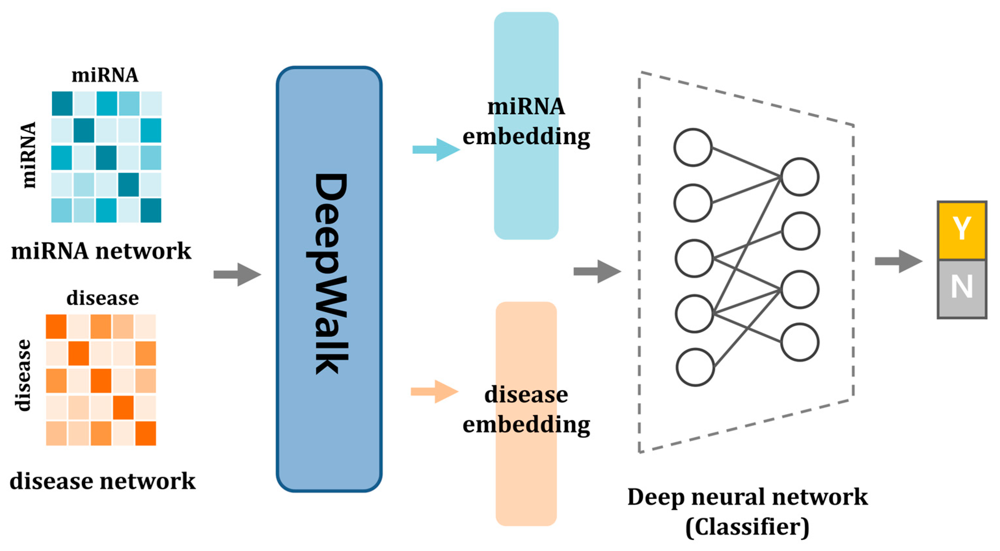
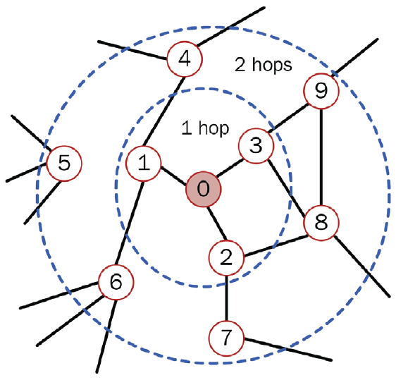
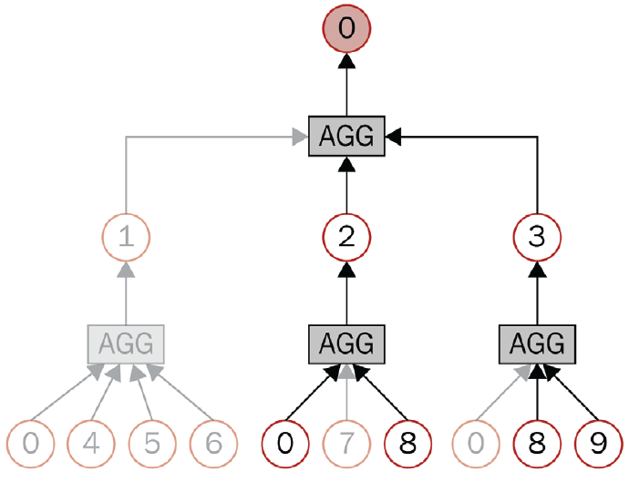

# Conceitos Fundamentais

## Grafos

Grafos são estruturas compostas por um conjunto de nós (ou vértices) e arestas que conectam esses nós, permitindo representar relações entre diferentes elementos.
Formalmente, um grafo pode ser definido como:

$$G = (V, E)$$

em que $V$ representa o conjunto de vértices e $E$ o conjunto de arestas do grafo.


<div style="position: relative; width: 45%; height: 500px; margin: auto; text-align:center;">
<figure class="fragment" data-fragment-index="1" 
        style="position:absolute; top:0; left:0; width:70%; margin:0;">
    
  </a>
</figure>
</div>

A partir de um grafo é possível representar um sistema complexo como: Estrutura de um programa, Sistema Físico e dentra da bilogia temos inúmeros exemplos, Caminhos Metabólicos, Redes Regulatórias, etc .

## Aprendizado baseado em Grafos

A partir da união das redes neurais com os grafos podemos resolver diversos tipos de problemas:

- Classificação de Nós: Predizer a categoria de um nó
- Predição de um Link: Predizer link entre nós que estão faltando
- Classificação do Grafo: A partir de todo o grafo predizer uma categoria para ele
- Geração de Grafo: Assim como dados sintéticos, é possível gerar grafos sintéticos, ou seja, novos grafos a partir de algum propriedade que esteja nos outros grafos (principal aplicação é gerar novas moléculas para descoberta de novos medicamentos)

## Grafos Direcionados e Não direcionados

::: {layout-ncol=1 style="text-align:center;"}

```{python}
#| echo: true
import networkx as nx
import matplotlib.pyplot as plt
plt.figure(figsize=(6, 4))
G = nx.DiGraph()
G.add_edges_from([('Fabricio', 'Matheus'), ('Fabricio', 'Lucas'), ('Matheus', 'Lucas')])
nx.draw( G, with_labels=True, node_color='lightgreen', font_weight='bold', node_size=1500, arrowsize=15, edge_color='gray')
plt.margins(0.2)
plt.show()
```
:::

## Grafos Direcionados 
::: {layout-ncol=1 style="text-align:center;"}
```{python}
#| echo: true
# Criando um grafo não direcionado
Z = nx.Graph()
Z.add_edges_from([('Fabricio', 'Matheus'), ('Fabricio', 'Lucas'), ('Matheus', 'Lucas')])
nx.draw( Z, with_labels=True, node_color='lightgreen', font_weight='bold', node_size=1500, arrowsize=15, edge_color='gray')
```
:::

## Grafos ponderados
::: {layout-ncol=1 style="text-align:center;"}
```{python}
#| echo: true
plt.figure(figsize=(6, 3)) 
GP = nx.Graph()
GP.add_edges_from([('H', 'O', {"weight": 4}), ('H', 'K', {"weight": 13}),
                   ('K', 'T', {"weight": 30}), ('T', 'O', {"weight": 10})])
pos = nx.spring_layout(GP)
nx.draw(GP, pos, with_labels=True, node_color='lightblue', node_size=800)
# Desenha os pesos das arestas
labels = nx.get_edge_attributes(GP, "weight")
nx.draw_networkx_edge_labels(GP, pos, edge_labels=labels)
plt.margins(0.2)
plt.show()
```
:::


## Grafos Conectados e Disconectados

Um grafo é dito conectado se existe um caminho entra quaisquer dois vértices do grafo, caso contrário, o grafo é dito desconectado.

```{python}
#| echo: true
plt.figure(figsize=(5, 2)) 
G = nx.Graph()
G.add_edges_from([(1, 3), (3, 4), (4, 1), (5, 6)])
# Exibe o resultado do teste
print(f"O grafo está conectado? {nx.is_connected(G)}")
# Desenho do Grafo
nx.draw(G, with_labels=True, node_color='salmon', node_size=600)
plt.margins(0.2)
plt.show()
```

## Grau e Vizinhança

* **Grau de um nó:** número de arestas incidentes ao vértice. Uma aresta é dita incidente a um nó quando o vértice é uma de suas extremidades.
* **Grafos direcionados:** nesse caso, distinguimos:
  * **Grau de entrada (*in-degree*):** número de arestas que chegam ao nó.
  * **Grau de saída (*out-degree*):** número de arestas que saem do nó.
* **Ciclo:** caminho em que o primeiro e o último vértice visitados são iguais.
* **Vizinhos:** são os nós diretamente conectados a um determinado vértice. Dois nós são considerados adjacentes quando existe uma aresta ligando-os diretamente.

## Grau e Vizinhança
::: {layout-ncol=1 style="text-align:center;"}
```{python}
#| echo: true
plt.figure(figsize=(5, 2))
Z = nx.Graph()
Z.add_edges_from([('Fabricio', 'Matheus'), ('Fabricio', 'Lucas'), ('Matheus', 'Lucas')])

print(f"Grau(Lucas) = {Z.degree['Lucas']}")

# Desenho do Grafo
nx.draw(Z, with_labels=True, node_color='orange', node_size=1000, font_size=10)
plt.margins(0.3)
plt.show()
```
:::

## Medidas de um grafo 

* **Centralidade de grau:** métrica mais simples, baseada apenas no grau do nó. Quanto maior seu valor, maior a indicação de que o vértice possui muitas conexões com outros nós do grafo e, consequentemente, maior influência na rede.
* **Centralidade de proximidade:** mede o quão próximo um nó está dos demais nós da rede, considerando a média das distâncias dos menores caminhos entre esse nó e todos os outros vértices.
* **Centralidade de intermediação:** mede quantas vezes um nó aparece nos menores caminhos entre pares de vértices. Valores elevados indicam que o nó atua como uma ponte entre diferentes regiões da rede.

## Medidas de um grafo 

Grau:

$$
  C_D(v) = \frac{deg(v)}{|V|-1}
$$

Proximidade:

$$
  C_C(v) = \frac{1}{\sum_u d(v,u)}
$$

Intermediação:

$$
  C_B(v) = \sum_{s,t} \frac{\sigma_{st}(v)}{\sigma_{st}}
$$

## Medidas de um grafo

```{python}
#| echo: true
print(f"Grau de Centralidade = {nx.degree_centrality(G)}")
print(f"Centralidade de proximidade = {nx.closeness_centrality(G)}")
print(f"Centralidade de intermediação= {nx.betweenness_centrality(G)}")
```

## Representação matriz adjacente

Uma matriz adjacente representa as arestas do grafo, indicando onde existe uma aresta entre dois nós. A matriz tem tamanho $n \times n$, onde $n$ é o número de nós do grafo. O valor de $1$ na célula $(i,j)$ indica que existte uma aresta entre os nós $i$ e $j$, caso contrário o valor indicado é $0$.

<div style="position: relative; width: 50%; height: 500px; margin: auto; text-align:center;">
<figure class="fragment" data-fragment-index="1" 
        style="position:absolute; top:0; left:0; width:100%; margin:0;">
    
  </a>
</figure>
</div>

# Criando Representações de Nós - DeepWalk

## Word2Vec

A ideia central do *Word2Vec* fornece a base conceitual para muitos modelos aplicados a grafos. O objetivo do Word2Vec é transformar palavras em vetores, criando representações contínuas capazes de capturar relações semânticas.

Esse objetivo é semelhante ao encontrado em aprendizado em grafos, no qual buscamos gerar representações vetoriais significativas para os nós e para a própria estrutura do grafo.


$$
  v_i \rightarrow z_i \in \mathbb{R}^d
$$

## Word2Vec

Um exemplo simples de representação vetorial é:
$$\begin{aligned}
vec(ator) &= [-2, 3, 1] \\
vec(atriz) &= [-1.9, 2, 1.5] \\
vec(homem) &= [3, -1, -2] \\
vec(mulher) &= [2.5, -2.5, -1]
\end{aligned}$$

Uma forma comum de medir a similaridade entre vetores é utilizando a similaridade de cosseno:

$$\text{similaridade de cosseno} = \frac{A \cdot B}{||A|| \cdot ||B||}$$

Com representações vetoriais, torna-se possível capturar relações semânticas entre palavras, por exemplo:
$$vec(ator) - vec(homem) + vec(mulher) \approx vec(atriz)$$

## Word2Vec - Skip-grams e CBOW

As duas principais abordagens para construir modelos *Word2Vec* são o **CBOW** (*Continuous Bag of Words*) e o **Skip-Gram**.

* **CBOW:** utiliza as palavras do contexto para predizer a palavra central.
* **Skip-Gram:** realiza o processo inverso, utilizando uma palavra para predizer seu contexto.

O modelo *Skip-Gram* é implementado a partir de pares $(input, contexto)$, em que o termo $contexto$ representa a palavra que o modelo deseja prever a partir da palavra de entrada.

## Skip-grams

Dado o tamanho do vetor de contexto $C$, queremos maximizar a probablidade de ver o contexto dado a palavra de input:

$$
  \frac{1}{N}\sum_{n=1}^N \sum_{-C \leq j \leq C} log p(w_{n+j}|w_n)
$$

A probabilidade é computada pelo softmax do embeding do contexto $h_c$ dado o embedding do input $h_t$:

$$
  p(w_c|w_t) = \frac{exp(h_c h_t^T)}{\sum_{i=1}^{|V|}exp(h_i h_t^T)}
$$

## Skip-grams

Um skip-gram possui 2 camadas, uma de projeção linear com a matriz de peso $W_{embed}$, que recebe o one-hot encoded das palavras e depois uma camada densa com a matriz de pesos $W_{output}$.

Então temos os passos:

- 1° embedding: $h = W^t_{embed} \dot x$
- 2° camada densa com softmax: $p(w_c|w_t) = \frac{exp(W_{output} \dot h)}{\sum_{i=1}^{|V|}exp(W_{output_{i}} \dot h)}$

## DeepWalk - Random Walks

O objetivo de criar representações úteis permanece no *DeepWalk*, mas, em vez de palavras, utilizamos nós do grafo.

Para isso, emprega-se um algoritmo conhecido como *Random Walk*, responsável por gerar sequências significativas de nós, de forma análoga às sequências de palavras em linguagem natural.

A ideia central consiste em construir trajetórias no grafo a partir da escolha aleatória de vizinhos a cada etapa. Assim, se determinados nós aparecem frequentemente nas mesmas sequências, isso indica que possuem algum tipo de proximidade estrutural ou semântica dentro do grafo.


## DeepWalk

DeepWalk nada mais é do que a combinação do Random Walk com o Word2Vec

<div style="position: relative; width: 100%; height: 500px; margin: auto; text-align:center;">
<figure class="fragment" data-fragment-index="1" 
        style="position:absolute; top:0; left:0; width:100%; margin:0;">
    
  </a>
</figure>
</div>

## Exemplo DeepWalk

Referência: [https://www.mdpi.com/2227-9059/13/3/536](https://www.mdpi.com/2227-9059/13/3/536)

<div style="position: relative; width: 70%; height: 500px; margin: auto; text-align:center;">
<figure class="fragment" data-fragment-index="1" 
        style="position:absolute; top:0; left:0; width:100%; margin:0;">
    
  </a>
</figure>
</div>

# Incluindo Features nos Nós - Introdução a GNN

## Incluindo Features nos Nós - Introdução a GNN

Até agora, consideramos apenas a topologia do grafo. No entanto, grafos geralmente são mais ricos do que apenas suas conexões: tanto nós quanto arestas podem possuir *features* associadas.

Para ilustrar isso, utilizaremos o dataset *Cora*, que representa 2.708 publicações científicas, nas quais as conexões correspondem a citações entre os artigos. Cada publicação é descrita por um vetor binário de 1.433 palavras únicas. O objetivo é classificar cada nó em uma de 7 categorias possíveis.


## Primeiro Graph Neural Network

No modelo tradicional de redes neurais, podemos definir a representação como $h_A = x_A W^T$, em que $x_A$ é o vetor de entrada do nó (A) e $W$ é a matriz de pesos aprendida.

O problema é que, em um grafo, os vetores de entrada correspondem apenas às *features* dos nós, o que significa que cada nó é tratado de forma isolada, sem considerar suas conexões Para incorporar simultaneamente a informação das *features* e da topologia do grafo, é necessário considerar a vizinhança de cada nó, agregando informações dos nós conectados a ele.

Graph Linear Layer:

$$
  h_a = \sum_{i \in \mathcal{N}_A} x_i W^T
$$

## Primeiro Graph Neural Network

Por questão de eficiência utilizamos a matriz adjacência que é mais simples e rápido de computar:

$$
  H = \widetilde{A}^T X W^T
$$

Em que $\widetilde{A} = A + I$, para computar o próprio nó.

## Graph Linear Layer:

```{python}
#| echo: true
import torch
from torch.nn import Linear
class GNNLayer(torch.nn.Module):
    def __init__(self, dim_in, dim_out):
        super().__init__()
        self.linear = Linear(dim_in, dim_out, bias=False)

    def forward(self, x, adjacency):
        x = self.linear(x)
        x = torch.sparse.mm(adjacency, x)
        return x
```

# Graph Convolutional Network

## Graph Convolutional Network

Esse conceito foi introduzido por Kipf e Welling em 2017, com o objetivo de propor uma variante das CNNs adaptada para grafos, dando origem às *Graph Convolutional Networks (GCNs)*.

Assim como ocorreu com as CNNs na visão computacional, as GCNs se tornaram uma das arquiteturas mais populares dentro do campo das *Graph Neural Networks (GNNs)*.


## Limitações no nosso modelo

O nosso modelo tem uma limitação, vamos verificar novamente como é feito o cálculo:

$$
  h_i = \sum_{j \in \mathcal{N}_i} x_j W^T
$$

Perceba que não é levado em consideração o número de vizinhos, ou seja se um nó possui 1 vizinho e outro 100, não existe uma normalização, logo os valores ficarão muito discrepantes. 

## Solucionando o problema

Uma forma de resolver esse problema é simplesmente normalizar pelo grau do nó.

$$
  h_i = \frac{1}{deg(i)} \sum_{j \in \mathcal{N}_i} x_j W^T
$$

## Normalização Matricial

Para transformar a normalização em uma operação de multiplicação de matrizes, utilizamos a matriz de grau, que contabiliza o número de vizinhos de cada nó. A partir disso, existem duas formas comuns de normalização:

* $\widetilde{D}^{-1} \widetilde{A} X W^T$: normaliza cada linha das features, evitando que a magnitude de nós com muitos vizinhos cresça excessivamente.
* $\widetilde{A} \widetilde{D}^{-1} X W^T$: normaliza cada coluna das features, fazendo com que cada nó distribua sua informação de forma uniforme entre seus vizinhos, evitando que nós de alto grau dominem a propagação de informação.


## Normalização Matricial

A GCN utiliza uma normalização híbrida, com isso temos a GCN final:

$$
  H = \widetilde{D}^{-\frac{1}{2}} \widetilde{A} \widetilde{D}^{-\frac{1}{2}} X W^T
$$

## Graph Attention Network

As *Graph Attention Networks (GATs)* representam uma evolução teórica das *GNNs*. Em vez de utilizar apenas uma normalização fixa, elas introduzem fatores de ponderação aprendidos, calculados a partir da importância relativa de cada nó por meio de *self-attention*.

Esses fatores são chamados de *attention scores* $\alpha_{ij}$, que determinam o peso da influência do nó $j$ sobre o nó $i$. Com isso, a operação de *graph attention* pode ser definida como:


$$
  h_i = \sum_{j \in \mathcal{N}_i} \alpha_{ij} W x_j
$$

## Transformação Linear

Os scores de atenção calcula a importância entre o nó central $i$ e o vizinho $j$. Na camada de atenção do grafo, isso é representado pela concatenação dos vetores $[Wx_i || Wx_j]$:

$$
  a_{ij} = W_{att}^T[Wx_i || Wx_j]
$$

Após isso é aplicado uma função de ativação *LeakyRelu* e uma softmax:

$$
  e_{ij} = LeakyRelu(a_{ij})
  \alpha_{ij} = softmax(e_{ij}) = \frac{exp(e_{ij})}{\sum_{k \in \mathcal{N}_i} exp(e_{ik})}
$$

## Multi-head attention

Como já vimos na aula passada normalmente não usamos *self-attention* mas a *multi-head attention*. Existe duas formas de fazer isso na GAT:

- Média: A ideia é somar os diferentes embeddigs gerados e depois normalizar pelo número de heads $n$.
$h_i = \frac{1}{n}\sum_{k=1}^n \sum_{j \in \mathcal{N}_i} \alpha_{ij}^k W^k x_j$
- Concatenação: Concatena os diferentes embeddins, produzindo uma matriz maior.
$h_i = ||^n_{k=1}\sum_{j \in \mathcal{N}_i} \alpha_{ij}^k W^k x_j$

Uma regra simples para saber qual usar é: Se está em uma camada intermediaria utilize concateção, quando é a última camada da rede então use a média.

## Melhoria na GAT

Uma segunda versão do *Graph Attention Network* (GAT) foi proposta por Brody et al. (2021), com o objetivo de aumentar a capacidade de representação do modelo. A principal mudança é que, em vez de aplicar o mecanismo de atenção sobre a transformação linear da entrada, a atenção passa a ser aplicada posteriormente, o que torna a modelagem mais expressiva. Assim, a formulação fica:

::: {.columns}

::: {.column width="50%"}
### Antes (GAT)
<div style="font-size: 0.7em;">
$$
\alpha_{ij} = \frac{\exp(\text{LR}(\mathbf{a}^\top [\mathbf{W}x_i \Vert \mathbf{W}x_j]))}{\sum_{k \in \mathcal{N}_i} \exp(\text{LR}(\mathbf{a}^\top [\mathbf{W}x_i \Vert \mathbf{W}x_k]))}
$$
</div>
:::

::: {.column width="50%"}
### Depois (GATv2)
<div style="font-size: 0.7em;">
$$
\alpha_{ij} = \frac{\exp(\mathbf{a}^\top \text{LR}(\mathbf{W} [x_i \Vert x_j]))}{\sum_{k \in \mathcal{N}_i} \exp(\mathbf{a}^\top \text{LR}(\mathbf{W} [x_i \Vert x_k]))}
$$
</div>
:::

:::

# GraphSAGE

## GraphSAGE

O *GraphSAGE* (Hamilton et al., 2017) é uma *GNN* projetada para lidar com grafos de grande escala. Em áreas como biologia, é comum enfrentar problemas de escalabilidade devido ao volume massivo de dados. No entanto, modelos como GCN e GAT não são naturalmente otimizados para esse cenário.

O *GraphSAGE* introduz duas ideias principais:

* **Amostragem de vizinhos:** em vez de usar todos os vizinhos de um nó, apenas uma amostra é selecionada, reduzindo o custo computacional.
* **Operações de agregação:** as informações dos vizinhos amostrados são combinadas por meio de funções agregadoras para gerar a representação do nó.


## Amostragem de Vizinho

Nas primeiras aulas, discutimos o conceito de *batches* e como os otimizadores os utilizam durante o treinamento. Em redes tradicionais, essa amostragem é direta: em dados tabulares, cada linha pode ser um exemplo; em imagens, cada imagem já constitui uma amostra independente.

No caso de grafos, porém, essa definição não é tão simples, pois os dados são interdependentes e estruturados. Assim, surge a questão: como realizar a amostragem de um batch a partir de um grafo?


## Amostragem de Vizinho

A ideia consiste em duas etapas. Na primeira, ao calcular o *embedding* de um nó, utilizamos apenas a sua vizinhança. Isso significa que, para computá-lo, são necessários apenas os vizinhos diretos (1-hop).

Se a GNN possuir duas camadas, então o nó passa a depender dos vizinhos dos vizinhos (2-hops), e assim sucessivamente conforme a profundidade da rede aumenta.


<div style="position: relative; width: 40%; height: 500px; margin: auto; text-align:center;">
<figure class="fragment" data-fragment-index="1" 
        style="position:absolute; top:0; left:0; width:70%; margin:0;">
    
  </a>
</figure>
</div>

## Amostragem de Vizinho

Contudo, a computação no grafo torna-se cada vez mais custosa à medida que o número de *hops* aumenta ou quando o grau dos nós é muito elevado.

Para o segundo caso, uma forma de contornar esse problema é por meio da **amostragem de vizinhos**, na qual apenas um subconjunto dos vizinhos é utilizado durante a computação das representações dos nós.


<div style="position: relative; width: 50%; height: 500px; margin: auto; text-align:center;">
<figure class="fragment" data-fragment-index="1" 
        style="position:absolute; top:0; left:0; width:75%; margin:0;">
    
  </a>
</figure>
</div>

## Operação de agregação

A operação de agregação é somente para verificar qual operação usar para computar os embeddings, no artigo original 3 operações foram apresentadas:

- Agregador da média
- Agregador de long short-term memory (LSTM)
- Agregador de pooling

Vamos usar o agregador da média:

$$
  h_i = \sigma(W \dot mean_{j \in \mathcal{N}_i}(h_j))
$$

# Referências

## Referências

- Kipf, Thomas N., and Max Welling. "Semi-supervised classification with graph convolutional networks." arXiv preprint arXiv:1609.02907 (2016).
- Veličković, Petar, et al. "Graph attention networks." arXiv preprint arXiv:1710.10903 (2017).
- Brody, Shaked, Uri Alon, and Eran Yahav. "How attentive are graph attention networks?." arXiv preprint arXiv:2105.14491 (2021).
- Rossi, Emanuele, et al. "Temporal graph networks for deep learning on dynamic graphs." arXiv preprint arXiv:2006.10637 (2020).
- Pearson, Karl. "The problem of the random walk." Nature 72.1867 (1905): 342-342.

## Referências

- Hamilton, Will, Zhitao Ying, and Jure Leskovec. "Inductive representation learning on large graphs." Advances in neural information processing systems 30 (2017).
- Zhou, Jie, et al. "Graph neural networks: A review of methods and applications." AI open 1 (2020): 57-81.
- Perozzi, Bryan, Rami Al-Rfou, and Steven Skiena. "Deepwalk: Online learning of social representations." Proceedings of the 20th ACM SIGKDD international conference on Knowledge discovery and data mining. 2014.
- Grover, Aditya, and Jure Leskovec. "node2vec: Scalable feature learning for networks." Proceedings of the 22nd ACM SIGKDD international conference on Knowledge discovery and data mining. 2016.

